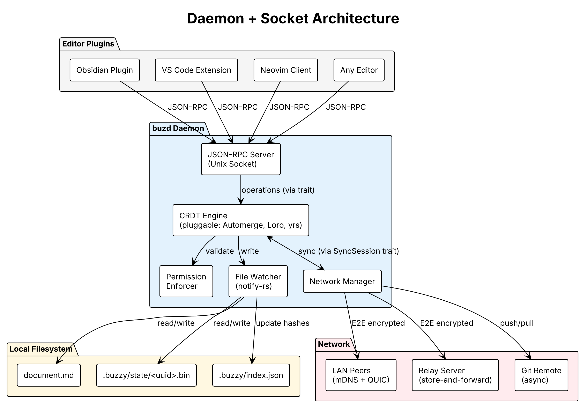
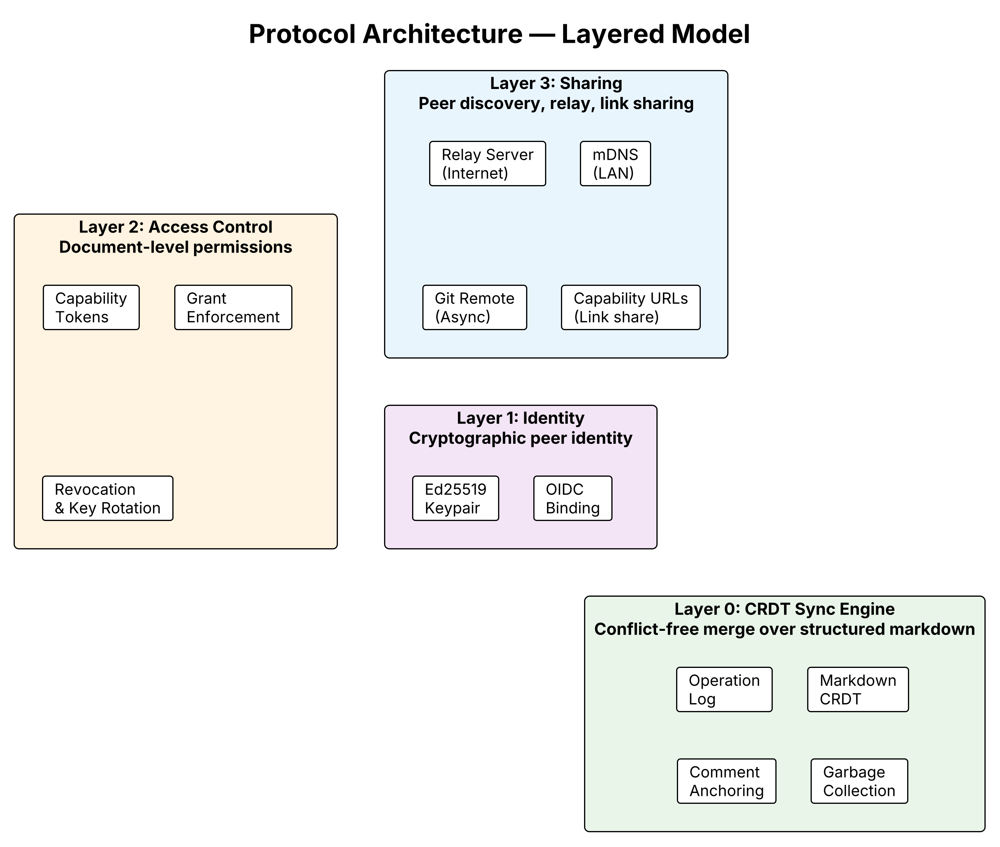
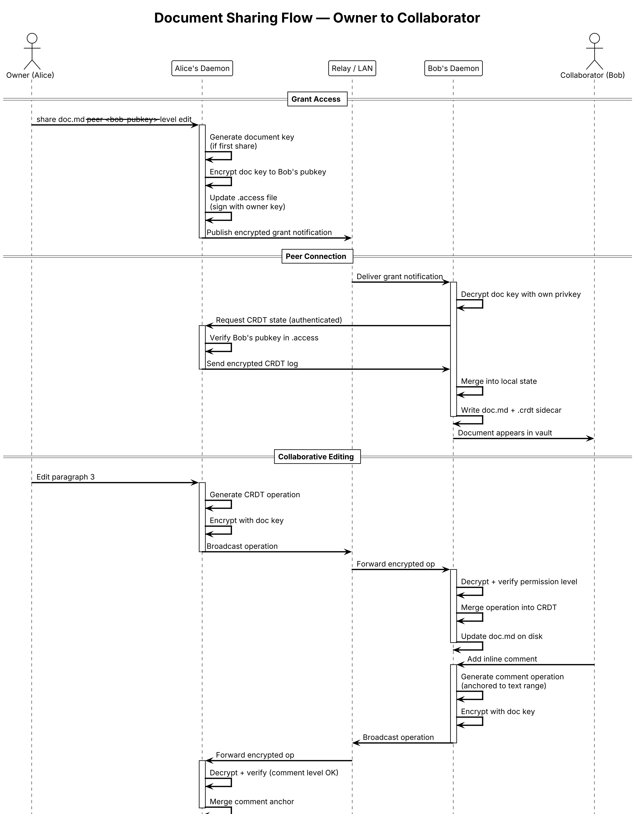
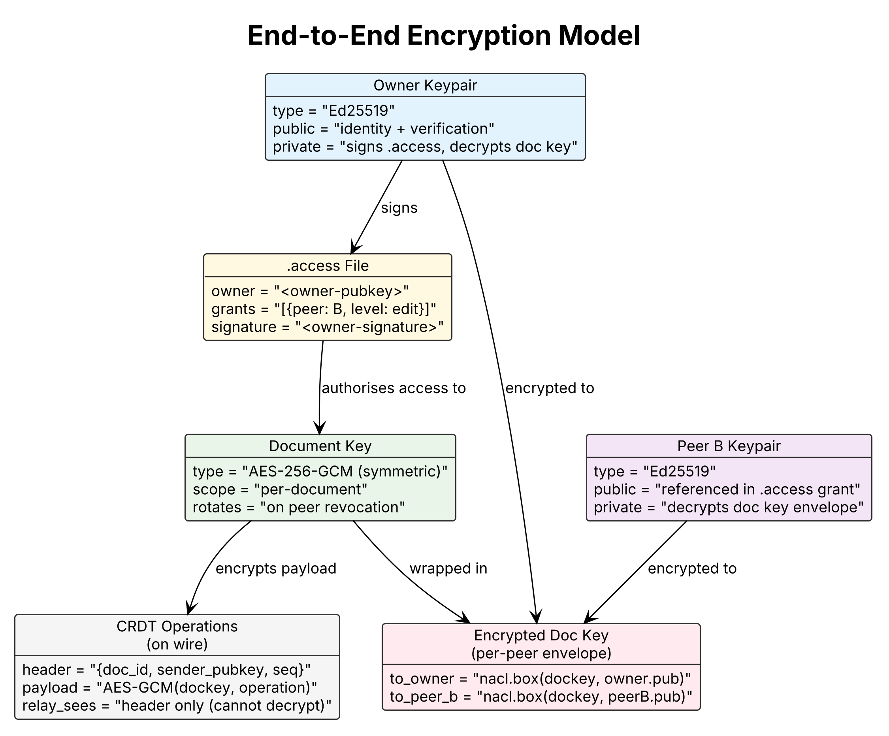
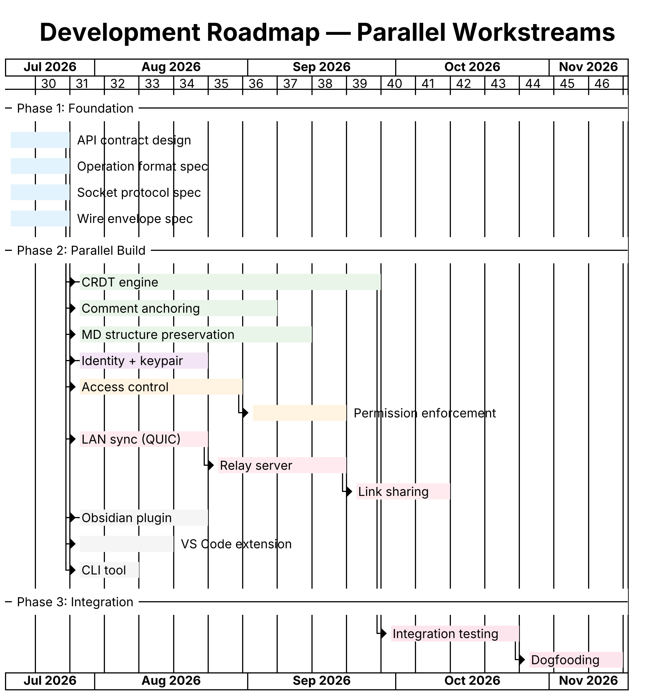
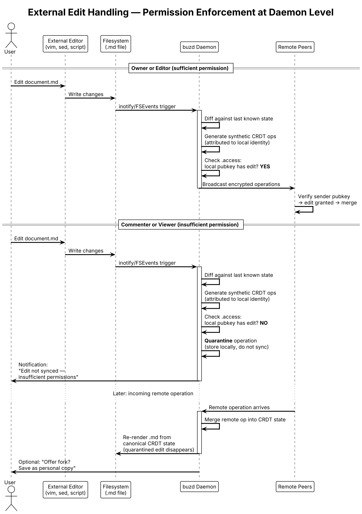

# Buzzy — Design Document

## Executive Summary

buzzy is a protocol-layer solution for real-time collaborative editing over local markdown files. Rather than building another editor, buzzy provides a daemon process and socket protocol that enables any text editor — Obsidian, VS Code, Neovim, or others — to participate in conflict-free multi-user collaboration while keeping documents as plain `.md` files on disk.

The project addresses a structural gap in the knowledge tooling landscape: collaborative editing (Quip, Notion, Google Docs) requires surrendering document portability to a vendor, while portable formats (Obsidian, plain markdown) lack real-time collaboration. buzzy resolves this tension at the protocol layer, treating collaboration as infrastructure rather than application feature.

The system uses a CRDT-based merge engine with end-to-end encryption, document-level access control via cryptographic capability tokens, and a layered architecture that allows identity, permissions, and networking to develop independently of the core sync engine.

---

## Scope & Assumptions

### What buzzy is

A protocol-layer collaboration engine. Text editing is the first format adapter; the architecture is format-extensible via the `CrdtDocument` trait. Any data type with defined concurrent-operation merge semantics can be collaborative.

### Explicit scope boundaries (MVP)

| Boundary | MVP constraint | Future expansion |
|----------|---------------|-----------------|
| **File types** | Plain text (`.md`, `.txt`, source code) | Any structured format via trait implementation |
| **Encoding** | UTF-8 only | Binary formats via format-specific adapters |
| **Document size** | <100KB typical | Chunked/streaming CRDT for large files |
| **Platform** | macOS and Linux (desktop) | Windows (Named Pipes); mobile (thin client via relay) |
| **Network** | LAN only (mDNS + direct QUIC) | WAN via relay + hole punching |
| **Peers** | Trusted (no encryption, no permissions) | E2E encryption + capability-token permissions |
| **Editors** | Obsidian (one plugin) | Any editor via JSON-RPC socket protocol |
| **AI** | Not in MVP | AI peers with permission-scoped operation stream access |
| **VCS detection** | Git only (`.git/index.lock`, `MERGE_HEAD`, `rebase-*`) | Configurable for Mercurial, Jujutsu, etc. |

### Assumptions

1. **Text files are the canonical source of truth.** The CRDT enables collaboration but is not authoritative. If the sidecar disagrees with the `.md` file, the `.md` wins. This inverts the normal local-first architecture (where CRDT is truth and plaintext is lossy export).

2. **Users run a single daemon per machine.** The daemon watches one or more vaults. Multi-machine collaboration happens via network sync, not by sharing a filesystem.

3. **External editors are common.** Users will edit `.md` files in vim, sed, scripts, and CI pipelines. The daemon must ingest these changes gracefully without treating every external write as a collaborative edit to broadcast.

4. **Git is a parallel workflow, not a competitor.** Users version-control the same files they collaborate on. buzzy handles real-time (sub-second, character-level); git handles versioning (per-commit, snapshot-level). They coexist on the same files without interfering.

5. **Not all file changes are collaborative edits.** Branch switches, merges, rebases, formatters, and build scripts modify `.md` files. The daemon must distinguish human edits (ingest + broadcast) from bulk tool operations (absorb silently or defer).

6. **Human-speed input is the norm.** The protocol is optimised for human typing speed (~100 WPM). AI peers generating at machine speed (10K tokens/sec) may need rate limiting or operation batching to avoid overwhelming the sync protocol.

7. **The CRDT engine is replaceable.** The architecture isolates the engine behind a trait boundary. Swapping from Automerge to Loro, yrs, or a custom implementation changes one crate; the rest of the system is unaffected.

8. **Mobile is thin-client only.** iOS/Android cannot run background daemons with filesystem access. Mobile clients connect via relay and receive rendered state; they don't run the full daemon.

9. **RTL languages, CJK composition, and combining characters work correctly.** Automerge's `update_text` uses `unicode_segmentation` for grapheme alignment. This is assumed correct but not extensively tested.

10. **The protocol is format-extensible.** Text is the first adapter. Audio (MIDI sequences, DAW project files), video (OpenTimelineIO), diagrams (JSON/SVG), and spreadsheets (cell-level CRDT) are all architecturally feasible via additional `CrdtDocument` implementations without protocol changes.

---

## Problem Statement

### The portability-collaboration trade-off

Every existing document tool forces a choice between two properties:

1. **Collaboration quality** — real-time editing, inline comments, presence indicators, permission-scoped sharing
2. **Storage portability** — documents stored in an open format, owned by the user, independent of any application's continued existence

Tools that excel at collaboration (Quip, Notion, Google Docs) store documents in proprietary formats or platform-specific databases. When the tool sunsets or the vendor changes direction, users face expensive migrations with data loss. Quip's architecture — where storage is inseparable from the application — exemplifies this vulnerability.

Tools that excel at portability (Obsidian, plain markdown, git-managed notes) offer no real-time collaboration. At most, they provide vault-level sync (obsidian-livesync) or version control (git), neither of which supports concurrent editing, inline commenting, or document-level sharing.

### Why this gap persists

The gap is architectural, not incidental. Real-time collaboration requires:

- A conflict resolution strategy (CRDT or Operational Transform)
- State that survives concurrent edits (comment anchors, cursor positions)
- A coordination layer for peer discovery and message routing

These requirements assume a mediating runtime — something that holds state between edits and resolves conflicts. Flat files on disk have no such runtime. Building one *inside* an editor plugin binds the collaboration capability to that specific editor. Building one as a protocol-level daemon makes it editor-agnostic while preserving the file-on-disk guarantee.


---

## Challenges

### 1. CRDT over structured markdown (high risk)

Plain-text CRDTs (Yjs, Automerge) handle character-level insertions and deletions. Markdown is not plain text — it has structural semantics (headings, tables, lists, code blocks). Concurrent edits that are individually valid can produce structurally invalid markdown.

**Examples:**
- Two users simultaneously edit different cells in the same table row — naive character merge may corrupt pipe alignment
- One user wraps text in a code fence while another edits inside it — fence boundaries conflict with content
- Nested list indentation changes that conflict at the whitespace level

**Mitigation:** Model markdown as a tree of blocks (similar to ProseMirror's document model), with character-level CRDTs within each block and structural CRDT operations for block-level changes (split, merge, reorder).

### 2. Comment anchoring across concurrent edits (high risk)

Comments must attach to text ranges. When the text they reference is edited by other users, the anchor must move intelligently — not point at the wrong paragraph or become orphaned.

**Requirements:**
- Anchors survive insertions and deletions around them
- Anchors degrade gracefully when their referenced text is deleted (marked as orphaned, not lost)
- Multiple overlapping anchors on the same range must remain distinguishable

**Mitigation:** Implement anchors as "sticky positions" in the CRDT — logical positions between characters that rebase as the document evolves. Reference: Peritext (Ink & Switch) addresses this exact problem for rich-text annotations.

### 3. Offline-to-online merge (medium risk)

Two users edit the same document offline for days, then reconnect. The CRDT must merge divergent histories without user intervention while producing a result that both users find sensible.

**Mitigation:** This is the core value proposition of CRDTs — Automerge handles this natively. The risk is in the *perception* of the merge result, not the mechanism. Users may need a "merge review" UI for large divergences.

### 4. File system reconciliation (medium risk)

The document exists as a `.md` file that any tool can edit. If a user opens the file in vim and makes changes outside the daemon, those changes must be detected and incorporated into the CRDT state.

**Mitigation:** File watcher (inotify/kqueue/FSEvents) detects external changes. Daemon diffs the file against its last known state and generates synthetic CRDT operations for the delta. This is conceptually similar to how git handles working tree changes.

### 5. Performance at scale (low risk, deferred)

Large documents (10k+ lines) with long edit histories may accumulate significant CRDT metadata. Garbage collection must compact history without breaking the ability of offline peers to rejoin.

**Mitigation:** Automerge's compaction algorithm handles this. Defer optimisation until real usage patterns emerge.

---

## Alternatives Considered

### Alternative 1: Full application (editor + collaboration)

Build a complete Obsidian-like application with built-in collaboration.

| Aspect | Assessment |
|--------|-----------|
| Effort | 26-37 engineer-months to MVP |
| Risk | Must compete on editor quality with mature tools |
| Adoption | Users must switch editors — high friction |
| Portability | Achievable, but tied to one application's continued development |

**Rejected because:** Rebuilds what already exists (editors) while concentrating risk in a single application. If the project stalls, users are back where they started.

### Alternative 2: Obsidian plugin

Build collaboration as an Obsidian community plugin.

| Aspect | Assessment |
|--------|-----------|
| Effort | 3-5 engineer-months |
| Risk | Obsidian plugin API may not expose necessary hooks for CRDT integration |
| Adoption | Limited to Obsidian users |
| Portability | Tied to Obsidian's continued existence and plugin architecture |

**Rejected because:** Obsidian's single-writer architecture works against real-time collaboration at the fundamental level. A plugin cannot change the file-handling model. Also locks collaboration to one editor.

### Alternative 3: CRDT sidecar format (no daemon)

Define a `.crdt` sidecar file format and ship libraries. Each editor implements sync independently.

| Aspect | Assessment |
|--------|-----------|
| Effort | 4-6 months for format + reference library |
| Risk | Every editor plugin must implement the full sync stack independently |
| Adoption | High barrier — plugin authors must understand CRDTs |
| Portability | Format is open; but collaboration quality varies by editor implementation |

**Rejected because:** Pushes too much complexity to plugin authors. A thin RPC client is a weekend project; a full CRDT sync implementation is months of work per editor.

### Alternative 4: Git-compatible operational log

Store edits as structured git operations; sync via git remotes.

| Aspect | Assessment |
|--------|-----------|
| Effort | 5-7 months |
| Risk | Real-time editing over git is fundamentally polling-based |
| Adoption | Familiar to developers; opaque to non-technical users |
| Portability | Excellent — git is universal |

**Rejected as primary approach because:** Cannot deliver real-time presence and sub-second edit propagation. Viable as an *additional* transport option (Layer 3), not as the core architecture.

---

## Chosen Approach: Daemon + Socket Protocol

### Architecture



A lightweight daemon (`buzd`) runs on each user's machine and owns the hard problems:

- CRDT state management and conflict resolution
- Comment anchor maintenance
- Permission enforcement at merge time
- Network peer management and sync
- File system watching and reconciliation

Editor plugins are thin JSON-RPC clients (~200 lines) that communicate with the daemon over a Unix socket. They send user operations (edit, comment, cursor move) and receive remote operations to apply.

### Layered Protocol Design



| Layer | Responsibility | Can develop independently |
|-------|---------------|--------------------------|
| **0: CRDT Sync** | Conflict-free merge over structured markdown | Core; no dependencies |
| **1: Identity** | Cryptographic peer identity (Ed25519 keypair + optional OIDC) | Needs only operation format from L0 |
| **2: Access Control** | Document-level capability tokens, grant enforcement | Needs operation format + identity |
| **3: Sharing** | Peer discovery, relay, link sharing | Needs only encrypted blob format |

Each layer depends only on the API contract of the layer below, enabling parallel development once interfaces are defined.

### Sharing and Permissions



Permissions are enforced at merge time in the daemon — not at a server. The relay (if used) is a dumb encrypted mailbox with no authority. Authority lives in cryptographic grants stored in a signed `.access` sidecar file alongside each document.

### Encryption



Every document has a per-document symmetric key (AES-256-GCM). Operations are encrypted before leaving the daemon. The relay server sees only opaque ciphertext. Document keys are wrapped per-peer using asymmetric encryption (X25519). Key rotation occurs on peer revocation.

### File Format

```
project/
├── meeting-notes.md              ← plain markdown (always readable without buzzy)
├── meeting-notes.md.crdt         ← CRDT operation log (binary, Automerge format)
├── meeting-notes.md.access       ← access control list (JSON, signed by owner)
└── meeting-notes.md.keys         ← per-peer encrypted document key envelopes
```

The `.md` file is always the canonical, human-readable document. The sidecar files enable collaboration but are not required to read the document. If buzzy disappears, you still have your markdown files.

---

## Development Plan



### Phase 1: API Contract Design (Weeks 1-2)

Define the three interface boundaries that enable parallel work:

1. **Operation format** — the shape of a single CRDT operation (insert, delete, comment-anchor, block-move)
2. **Socket protocol** — JSON-RPC methods between daemon and editor plugins
3. **Wire envelope** — encrypted transport format for Layer 3

### Phase 2: Parallel Build (Weeks 3-16)

Four independent workstreams:

| Stream | Team | Deliverable |
|--------|------|------------|
| CRDT engine | Senior engineer (strongest on the team) | Automerge-rs integration, markdown block model, comment anchoring |
| Identity + access control | 1 engineer | Keypair management, .access format, grant enforcement |
| Networking | 1 engineer | LAN sync (mDNS + QUIC), relay server, link sharing |
| Editor plugins | 1 engineer | Obsidian plugin, VS Code extension, CLI tool |

### Phase 3: Integration + Dogfooding (Weeks 17-20)

- Wire all layers together
- Internal dogfooding with the development team
- Performance profiling on large documents
- Edge case testing (offline divergence, permission revocation during active session)

### Technology Stack

| Component | Choice | Rationale |
|-----------|--------|-----------|
| Daemon language | Rust | Small binary, no runtime, cross-platform, memory safety |
| CRDT library | Automerge-rs | Most mature Rust CRDT, document-oriented model |
| Editor protocol | JSON-RPC over Unix socket | Same pattern as LSP; familiar to plugin authors |
| Networking | QUIC (quinn-rs) | Multiplexed, encrypted, handles NAT traversal |
| Peer discovery | mDNS (mdns-sd crate) | Zero-config LAN discovery |
| Desktop packaging | None (daemon only) | Editors are the UI; buzzy is headless |
| Encryption | libsodium (sodiumoxide) | Audited, well-understood primitives |

---

## Success Criteria

1. **Document remains readable without buzzy** — if you delete all sidecar files, the `.md` is intact and current
2. **Sub-500ms edit propagation** on LAN between two peers
3. **Offline merge produces valid markdown** — no structural corruption after multi-day divergence
4. **Plugin development takes < 1 week** for a new editor (measured by the VS Code extension effort)
5. **Comment anchors survive 95%+ of concurrent edit scenarios** without orphaning

---

## External Edit Handling

### The problem

buzzy enforces permissions at merge time — when a CRDT operation arrives from a peer, it checks the sender's pubkey against the `.access` grants. But when someone edits the `.md` file directly (vim, sed, a script, or any editor without the buzzy plugin), the file watcher detects a diff with no identity attached. It does not know who typed those characters.

This is where "local-first file ownership" and "permission enforcement" directly conflict.

### Design invariant

> The daemon treats the local machine's identity as the author of all file changes detected on that machine. Permission enforcement occurs at broadcast time (sender-side) and merge time (receiver-side). The file system is not a trust boundary — the daemon is.

### Source of truth

| Condition | Authority |
|-----------|-----------|
| buzd not running | The `.md` file on disk |
| buzd running | The CRDT state (daemon's memory); the `.md` file is a rendered projection |

When buzzy is active, the `.md` file is a view of the CRDT state — readable, editable, but not authoritative. External edits are ingested into the CRDT (attributed to the local identity), not the other way around.

### Behaviour by permission level



| Actor | Edits via plugin | Edits file directly (outside plugin) | Outcome |
|-------|-----------------|--------------------------------------|---------|
| Owner | Normal operation | Daemon ingests, attributes to owner keypair, broadcasts | Syncs normally |
| Editor | Normal operation | Daemon ingests, attributes to editor keypair, broadcasts | Syncs normally |
| Commenter | Can only add comments | Daemon detects edit, refuses to broadcast | Local-only; rolled back on next sync |
| Viewer | Read-only in plugin | Daemon detects edit, refuses to broadcast | Local-only; rolled back on next sync |

### Enforcement mechanics

**Sender-side (local daemon):**

1. File watcher detects change to `document.md`
2. Daemon diffs file content against last known CRDT-rendered state
3. Generates synthetic CRDT operations attributed to local keypair
4. Checks local identity's permission level in `.access`
5. If permission sufficient: broadcast operations to peers
6. If permission insufficient: quarantine operations (store locally, do not sync)

**Receiver-side (remote daemon):**

Even if the sender's daemon is modified or bypassed, the receiver independently verifies:

1. Incoming operation's sender pubkey checked against document's `.access` file
2. Operation type checked against granted permission level (edit ops from a comment-only peer are rejected)
3. Rejected operations are silently dropped — never merged into CRDT state

This dual enforcement ensures that a compromised or modified daemon on one machine cannot inject unauthorised content into other peers' copies.

### Rollback behaviour

The daemon does not immediately revert the file — that would be hostile UX (user types something and it vanishes mid-sentence). Instead:

1. External edit detected and quarantined
2. Local file retains the edit temporarily
3. Daemon emits notification: "edit not synced — insufficient permissions"
4. On next incoming remote operation: daemon re-renders `.md` from canonical CRDT state
5. Quarantined edit disappears from the file
6. Optional UX: daemon offers a fork — "save as personal copy?" (analogous to GitHub's fork-on-push-without-access pattern)

### Explicit non-goals

**Shared filesystem access (NFS, Dropbox, network mounts):**

If the `.md` file is on a shared mount and multiple users write to it directly, the daemon cannot attribute changes to any identity. buzzy assumes each user has their own copy with the daemon mediating sync. Shared filesystems bypass the daemon entirely and produce last-write-wins semantics — identical to the status quo without buzzy.

**Preventing copy-paste or screenshots:**

buzzy cannot prevent a viewer from copying document content outside the system. This is identical to end-to-end encrypted messaging — you can prevent injection of content back into the conversation, but not extraction of content that has already been rendered locally.

### Implications for the protocol

This constraint means:

- The daemon must maintain a "last rendered state" hash to diff against for external edit detection
- The quarantine store needs garbage collection (quarantined ops from months ago are stale)
- The notification/fork UX belongs in the socket protocol spec (editors need to surface this to users)
- Documentation must clearly state that buzzy protects *collaboration integrity*, not *content confidentiality* — once a document is rendered on a peer's machine, that peer has the content

---

## AI Integration (Protocol-Level)

### Design principle: AI as peer, not API call

buzzy's architecture enables AI to participate in collaboration as a first-class peer — with its own identity (keypair), permission level, and operation stream. This is fundamentally different from application-layer AI integrations (Notion AI, Google Docs AI) which operate as request-response tools with no presence in the collaboration model.

The AI peer:
- Has an Ed25519 keypair like any other participant
- Is granted a permission level by the document owner (viewer, commenter, editor)
- Subscribes to the CRDT operation stream in real-time
- Generates operations attributed to its own identity (auditable, revertable)
- Is subject to the same permission enforcement as human peers

### Architecture


The AI layer sits alongside the daemon as an optional, per-document opt-in capability:

```
buzd daemon
├── CRDT engine (core)
├── Permission enforcer (core)
├── Network manager (core)
└── AI peer (optional)
    ├── Operation classifier (detects intent/patterns in edit stream)
    ├── Semantic index (local embeddings, incremental)
    ├── Context assembler (cross-doc RAG)
    └── LLM interface (pluggable: local model or API)
```

### Capabilities enabled by protocol control

**1. Operation-stream intelligence**

The AI sees individual CRDT operations, not document snapshots. This enables:

| Capability | What the AI observes | What it produces |
|-----------|---------------------|-----------------|
| Edit velocity tracking | Repeated rewrites of a section | Comment: "this section may need discussion" |
| Conflict prediction | Two users editing adjacent ranges | Alert before semantic conflict emerges |
| Staleness detection | No operations on a doc for N days | Comment: "this is linked from 12 active docs but hasn't been updated" |
| Collaboration pattern analysis | Alternating edits by two users on same paragraph | Suggestion: "consider a comment thread instead" |

**2. Permission-scoped AI behaviour**


| AI permission level | Allowed actions | Blocked actions | Use case |
|--------------------|----------------|-----------------|----------|
| Viewer | Observe operation stream; build index | Any output to document | Silent learning, pattern collection |
| Commenter | Anchored inline comments | Text insertion/deletion | Review, fact-checking, style suggestions |
| Editor | Full text operations | Modifying `.access` | Co-authoring, summarisation, translation |

The document owner can change the AI's permission level at any time. If demoted from editor to commenter mid-session, the AI's subsequent edit-type operations are rejected by the same enforcement path as any peer.

**3. Semantic vault index**

The daemon maintains a local embedding index:

```
.buzzy/
├── embeddings/
│   ├── document-a.md.vec     (per-doc embedding)
│   ├── document-b.md.vec
│   └── index.meta            (incremental state)
```

Properties:
- **Incremental** — re-indexes only the changed blocks when CRDT operations arrive; not batch-reindex
- **Local** — all embeddings stored on-device; no content leaves without explicit configuration
- **Cross-document** — enables RAG across the entire vault when AI generates responses
- **Editor-accessible** — plugins can query the index via the socket protocol (semantic search as a JSON-RPC method)

**4. Multi-document agents**

Because buzzy manages the protocol for the entire vault, an AI agent can:

- Subscribe to multiple documents simultaneously
- Maintain consistency constraints ("if API doc changes, flag affected tutorial examples")
- Generate cross-document reports ("summarise decisions from all meeting notes this week")
- Enforce structural templates ("this document claims to be an RFC but is missing required sections")

**5. Selective AI revert**

Because AI operations are attributed to a distinct identity in the CRDT, any user with sufficient permission can:

- Filter the operation log by author (show only AI-generated content)
- Selectively revert AI operations without affecting human edits
- View document state "without AI contributions" (shadow view)

This is not possible in application-layer AI integrations where AI output is indistinguishable from user text once accepted.

### LLM backend (pluggable)

| Backend | Content leaves machine? | Latency | Use case |
|---------|------------------------|---------|----------|
| Local model (Ollama, llama.cpp) | No | Low | Privacy-critical, simple tasks |
| API (Claude, GPT) | Prompt + relevant context | Medium | Best quality, general use |
| Team-hosted model | Stays within org network | Medium | Enterprise compliance |

The AI layer is model-agnostic. It constructs prompts from the operation stream and semantic index; the LLM backend is a configuration choice, not an architectural dependency.

### Protocol extensions for AI

New JSON-RPC methods added to the socket protocol:

```
ai.subscribe     — register AI peer for a document's operation stream
ai.configure     — set AI backend, permission level, trigger rules
ai.query         — semantic search across vault index
ai.history       — filter operation log by AI identity
ai.revert        — selectively undo AI-authored operations
```

These are opt-in extensions; editors that don't implement AI features simply don't call these methods. The daemon handles all AI logic internally.

---

## Cryptographic Extensions (Post-MVP)

buzzy's architecture already uses blockchain-derived primitives (Ed25519 identity, Merkle DAG via Automerge's causal graph, content addressing, signed capability tokens). Two additional cryptographic extensions are planned for post-MVP that deepen the trust and permission model.

### Verifiable Timestamps (document notarisation)

**Problem:** In a P2P system with no central server, there is no authoritative clock. A malicious peer could backdate operations. For legal, IP, and compliance contexts, users need provable evidence that "this document state existed at time T."

**Solution:** Periodically anchor a hash of the CRDT state to a public timestamping service.

**Implementation:**

```
1. Daemon computes SHA-256 of current CRDT state (doc.save() hash)
2. Submits hash to OpenTimestamps (free, Bitcoin-backed)
3. Receives a timestamp proof (compact Merkle path to a Bitcoin block header)
4. Stores proof in .buzzy/timestamps/<uuid>/<block-height>.ots
5. Anyone can verify: given the .ots file + the .bin state file,
   cryptographically prove the document existed before that block's timestamp
```

**Properties:**
- No data leaves the machine — only a 32-byte hash is submitted
- Verification is offline once the proof is downloaded
- Cost: zero (OpenTimestamps is free; uses Bitcoin's OP_RETURN)
- Granularity: one anchor per document per day (configurable)
- Non-repudiable: the proof is valid as long as Bitcoin's chain is

**Use cases:**
- IP protection ("this invention disclosure existed before that filing date")
- Contract disputes ("this version of the agreement was accepted on this date")
- Compliance ("audit trail proves document state at time of regulatory review")
- Prior art ("this design document predates the patent application")

**Protocol extension:**

```json
// New JSON-RPC method
{"method": "doc.timestamp", "params": {"docId": "..."}}
// Returns: {proof: "<base64 .ots proof>", hash: "<sha256>", anchoredAt: "2026-07-20T..."}

// Query existing timestamps
{"method": "doc.timestamps", "params": {"docId": "..."}}
// Returns: [{hash, anchoredAt, blockHeight, verified: true/false}, ...]
```

**Architecture fit:** This is a pure addition — no changes to the CRDT engine, sync protocol, or editor plugins. A background job in the daemon periodically submits hashes. The timestamps are stored alongside CRDT state and can be verified independently.

### UCAN (User Controlled Authorization Networks)

**Problem:** buzzy's permission model (`.access` file with signed grants) needs delegation without a server. Alice wants to give Bob access; Bob wants to give Carol read-only access to a subset. How does this chain of delegation work without calling home?

**Solution:** Adopt UCAN semantics for the permission token format.

**What UCAN provides:**

UCANs (from the Fission/IPFS ecosystem) are JWT-like tokens with three key properties:
1. **Self-contained** — verification requires only the token and the issuer's public key (no server call)
2. **Delegatable** — a token holder can issue sub-tokens with equal or reduced permissions
3. **Chainable** — each token references its parent; verification walks the chain to the root authority

**How it maps to buzzy:**

```
Current .access model:
  Owner signs: "Bob has edit access to doc X"
  → Bob can edit
  → Bob CANNOT delegate to Carol (only owner can grant)

UCAN model:
  Owner issues UCAN: {iss: owner, aud: Bob, att: [{doc: X, can: "edit"}]}
  Bob issues sub-UCAN: {iss: Bob, aud: Carol, att: [{doc: X, can: "read"}], prf: [owner's UCAN]}
  → Carol can read (verified by chain: Carol's token → Bob's token → Owner's root)
  → Carol CANNOT write (Bob's sub-token attenuated from "edit" to "read")
```

**Properties:**
- No server needed for verification (follow the signature chain)
- Delegation is offline-capable (Bob can grant Carol access while both are offline)
- Attenuation is enforced (sub-tokens can only reduce permissions, never escalate)
- Revocation via expiry (tokens have a TTL) or explicit revocation list (published by issuer)
- Interoperable with the UCAN ecosystem (Fission, IPFS, any tool using `ucans` library)

**Concrete changes to the permission model:**

| Current design | With UCAN |
|---------------|-----------|
| `.access` file is a flat JSON with owner-signed grants | `.access` file contains UCAN tokens (JWT-like, base64-encoded) |
| Only owner can grant access | Any peer with sufficient permission can delegate (attenuated) |
| Revocation = owner publishes new `.access` | Revocation = expiry + optional revocation list |
| Verification = check signature against owner key | Verification = walk UCAN chain to root, verify each signature |

**Implementation:**

```rust
// UCAN token structure (simplified)
struct Ucan {
    header: UcanHeader,      // alg: EdDSA, typ: JWT, ucv: "0.10.0"
    payload: UcanPayload {
        iss: Did,            // issuer's DID (did:key:<pubkey>)
        aud: Did,            // audience's DID
        exp: Option<u64>,    // expiry timestamp
        att: Vec<Capability>,// [{resource: "buzzy:doc:<uuid>", ability: "edit"}]
        prf: Vec<Cid>,       // proof chain (CIDs of parent UCANs)
    },
    signature: Vec<u8>,      // Ed25519 signature over header.payload
}

// Verification
fn verify_ucan_chain(token: &Ucan, root_key: &PublicKey) -> Result<Capability> {
    // 1. Verify signature
    // 2. Check expiry
    // 3. If prf is empty → iss must be root_key (self-issued root)
    // 4. If prf is non-empty → recursively verify parent; check attenuation
    // 5. Return the effective capability (most restricted in the chain)
}
```

**Use cases:**
- Team lead grants edit access to their team; team members grant read access to stakeholders
- Temporary access (24-hour review window) via token expiry
- Third-party integrations (CI system gets a scoped token to read docs for linting)
- AI peer delegation (owner grants AI "comment" permission; AI cannot self-escalate because UCAN attenuates)

**Ecosystem alignment:** UCAN is an open spec (`ucan.xyz`) with implementations in TypeScript, Rust (`ucan-rs`), Go, and Swift. Adopting it gives buzzy interoperability with Fission, WNFS (WebNative File System), and any tool using the UCAN ecosystem — without inventing a custom permission token format.

### What buzzy does NOT adopt from blockchain

| Concept | Reason for exclusion |
|---------|---------------------|
| Global consensus (PoW/PoS) | CRDTs are consensus-free by design; adding consensus contradicts the architecture |
| Tokens / cryptocurrency | Adds regulatory burden and complexity for marginal benefit; relay costs are small |
| On-chain permissions | Latency (block time), cost (gas), and chain availability dependency; local verification is instant and offline |
| NFTs for document ownership | The file on disk IS ownership; a token adds nothing |
| Smart contracts for merge rules | The CRDT IS the merge rule; Solidity adds a layer with no benefit |
| DAO governance | Irrelevant — users govern their own data by running the daemon |

The principle: adopt cryptographic primitives where they solve real problems (timestamping, delegation). Reject economic mechanisms and consensus protocols that add complexity without solving a problem buzzy actually has.

---

## Open Questions

1. **Garbage collection strategy** — how aggressively to compact CRDT history vs. supporting late-rejoining peers
2. **Block-level vs. character-level CRDT** — whether to use a hybrid model or pure character CRDT with markdown validation as a post-merge pass
3. **Merge review UX** — whether to surface a diff UI for large offline divergences or rely entirely on automatic merge
4. **Plugin API stability** — versioning strategy for the socket protocol as features are added
5. **Mobile support** — whether the daemon model translates to iOS/Android or requires a separate thin-client approach
6. **AI trigger design** — whether AI responds to all operations automatically or requires explicit invocation (@ mention, command); likely configurable per-document
7. **AI operation attribution UX** — how editors visually distinguish AI-authored content from human content (colour, icon, gutter mark)
8. **Embedding model choice** — whether to ship a default local embedding model or require user configuration; trade-off between zero-config UX and binary size
9. **Timestamp anchoring frequency** — daily vs per-commit vs on-demand; trade-off between proof granularity and Bitcoin fee cost (currently near-zero via OpenTimestamps batching)
10. **UCAN revocation propagation** — how quickly revoked tokens propagate to all peers; expiry-based (simple, eventual) vs explicit revocation list (faster, requires distribution)
