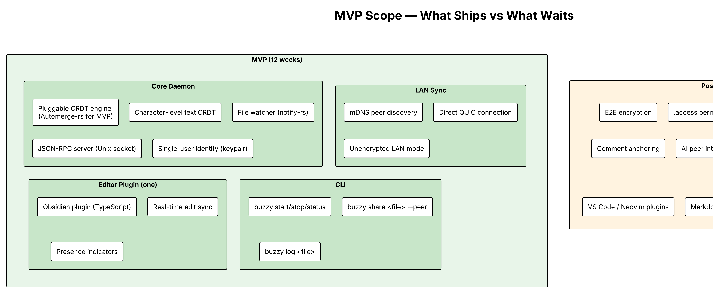
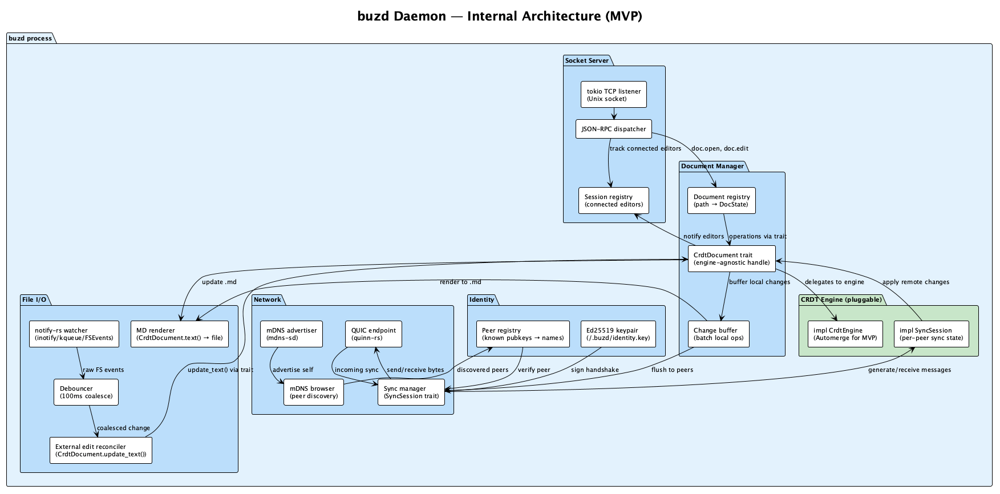
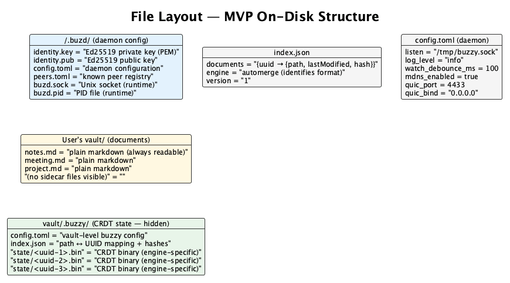
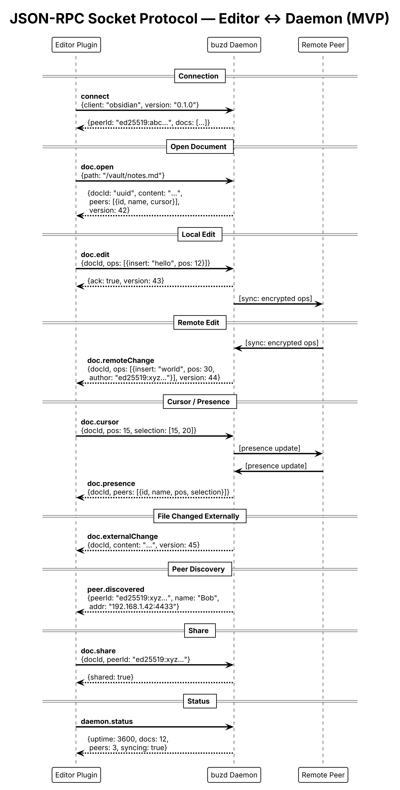
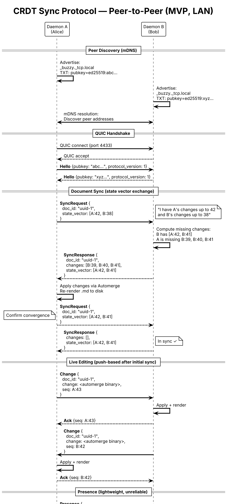
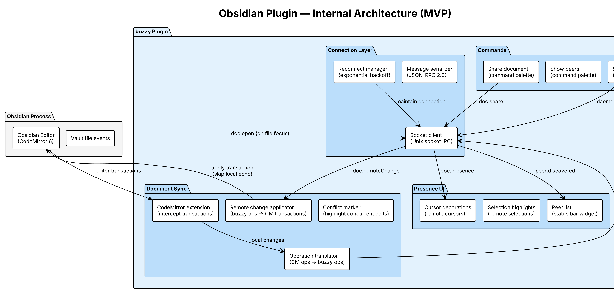
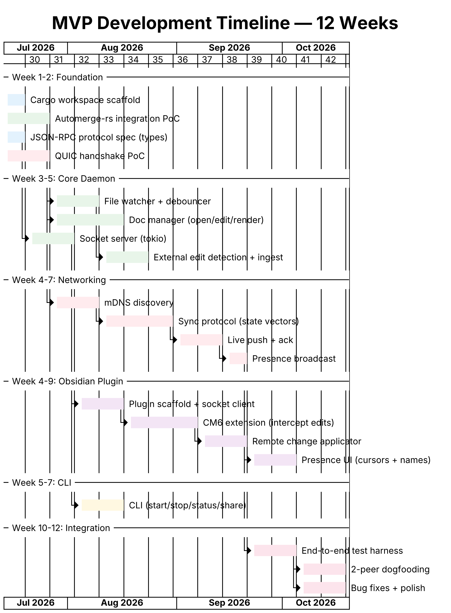

# Buzzy MVP — Low-Level Design

## Premise

buzzy becomes to collaboration what git became to version control — invisible infrastructure that every tool builds on. The MVP proves the core thesis: a daemon-based CRDT sync engine can deliver real-time collaboration over plain markdown files, with zero dependency on any specific editor or cloud service.

The MVP is deliberately minimal. It demonstrates the architecture, validates the performance model, and produces something two developers on the same LAN can use daily. Everything else — encryption, permissions, relay, comments, AI — is deferred until this foundation is proven.

---

## MVP Scope



### What ships (12 weeks)

| Component | Deliverable |
|-----------|------------|
| buzd daemon | Rust binary; file watching, CRDT engine, socket server, LAN sync |
| LAN networking | mDNS peer discovery + QUIC direct connection (unencrypted for MVP) |
| Obsidian plugin | TypeScript; real-time edit sync, remote cursors, presence |
| CLI | `bzz start`, `bzz stop`, `bzz status`, `bzz share`, `bzz log` |

### What waits (post-MVP)

| Deferred | Reason |
|----------|--------|
| E2E encryption | Adds complexity without proving the sync model; LAN-only MVP is trusted-network |
| .access permissions | Requires identity management; MVP assumes trusted peers |
| Relay server | MVP is LAN-only; relay requires encryption (otherwise relay can read content) |
| Comment anchoring | Requires block-level CRDT design decisions; character-level MVP ships faster |
| AI peer | Requires comment system + stable operation format |
| Additional editor plugins | One plugin proves the protocol; others follow the same contract |
| Markdown block-level CRDT | Character-level is sufficient for MVP; block-level is an optimisation |

### MVP success criteria

1. Two users on the same LAN edit a shared `.md` file simultaneously in Obsidian
2. Edits appear on the other user's screen within 500ms
3. Remote cursors and selections are visible
4. If one user closes Obsidian and edits the file in vim, changes sync on next daemon cycle
5. If both users edit offline and reconnect, merge produces valid text (no corruption)
6. The `.md` file is always plain markdown readable by any tool
7. `git checkout <branch>` does NOT broadcast intermediate states or conflict markers to peers
8. `git merge` with conflicts does NOT corrupt the CRDT — daemon waits for resolution
9. `.buzzy/` does not appear in `git status` (self-gitignored by default)

---

## Daemon Architecture



### Process model

Single-threaded async runtime (tokio). The daemon handles:

- Socket connections from editors (multiple simultaneous editors supported)
- File system events (one watcher per vault)
- Network connections to peers (multiple simultaneous peers)

All I/O is non-blocking. CPU-intensive work (CRDT merges on large documents) runs on `tokio::task::spawn_blocking` to avoid stalling the event loop.

### Startup sequence

```
1. Read ~/.buzd/config.toml
2. Load or generate identity keypair (~/.buzd/identity.key)
3. Bind Unix socket (config.listen path)
4. Write PID file
5. Start mDNS advertiser (announce self on _buzzy._tcp.local)
6. Start mDNS browser (discover other buzd instances)
7. Bind QUIC endpoint (config.quic_port, default 4433)
8. Start file watcher on configured vault paths
9. Load CRDT state for previously-opened documents (from .buzzy state)
10. Accept socket connections (ready for editors)
```

### Shutdown sequence

```
1. SIGTERM/SIGINT received (or "bzz stop" via socket)
2. Flush pending changes to .buzzy state files
3. Render final .md state to disk
4. Send goodbye to connected peers (graceful QUIC close)
5. Close editor socket connections
6. Remove PID file and socket file
7. Exit 0
```

### Crate structure

The CRDT engine is isolated behind a trait boundary in `buzzy-crdt`. The rest of the system (daemon, networking, CLI, plugins) depends only on traits, never on Automerge types directly. This allows swapping the CRDT engine (to Loro, yrs, or a custom implementation) without modifying any crate except `buzzy-crdt-automerge`.

```
buzzy/
├── Cargo.toml                    (workspace)
├── crates/
│   ├── buzzy-crdt/              (CRDT engine trait — the abstraction boundary)
│   │   ├── src/
│   │   │   ├── lib.rs           (pub trait CrdtEngine + pub trait SyncProtocol)
│   │   │   ├── traits.rs        (CrdtEngine, CrdtDocument, SyncSession traits)
│   │   │   ├── types.rs         (DocId, PeerId, Operation, SyncMessage — engine-agnostic)
│   │   │   └── error.rs         (CrdtError enum)
│   │   └── Cargo.toml           (no dependencies on automerge/yrs/etc)
│   ├── buzzy-crdt-automerge/    (Automerge implementation of CrdtEngine trait)
│   │   ├── src/
│   │   │   ├── lib.rs
│   │   │   ├── engine.rs        (impl CrdtEngine for AutomergeEngine)
│   │   │   ├── document.rs      (impl CrdtDocument for AutomergeDoc)
│   │   │   └── sync.rs          (impl SyncSession for AutomergeSyncState)
│   │   └── Cargo.toml           (depends on: buzzy-crdt, automerge ^0.10)
│   ├── buzzy-daemon/            (runtime: socket server, file watcher, orchestration)
│   │   ├── src/
│   │   │   ├── main.rs
│   │   │   ├── config.rs        (config.toml parsing)
│   │   │   ├── server.rs        (Unix socket + JSON-RPC dispatch)
│   │   │   ├── watcher.rs       (notify-rs + debounce)
│   │   │   ├── renderer.rs      (CRDT state → .md file write — via CrdtDocument trait)
│   │   │   └── registry.rs      (document registry: path → DocState)
│   │   └── Cargo.toml           (depends on: buzzy-crdt, NOT buzzy-crdt-automerge)
│   ├── buzzy-net/               (networking: mDNS, QUIC, sync protocol)
│   │   ├── src/
│   │   │   ├── lib.rs
│   │   │   ├── mdns.rs          (advertise + browse)
│   │   │   ├── quic.rs          (connection management)
│   │   │   ├── sync.rs          (state vector exchange — via SyncSession trait)
│   │   │   └── presence.rs      (cursor broadcast, unreliable)
│   │   └── Cargo.toml           (depends on: buzzy-crdt, NOT buzzy-crdt-automerge)
│   ├── buzzy-cli/               (CLI binary: start, stop, status, share)
│   │   ├── src/
│   │   │   └── main.rs
│   │   └── Cargo.toml
│   └── buzzy-protocol/          (shared types: RPC messages, op format)
│       ├── src/
│       │   ├── lib.rs
│       │   ├── rpc.rs           (JSON-RPC request/response types)
│       │   ├── ops.rs           (operation format, serde — engine-agnostic)
│       │   └── wire.rs          (network message types)
│       └── Cargo.toml
├── plugin-obsidian/             (TypeScript, separate build)
│   ├── src/
│   │   ├── main.ts             (plugin entry)
│   │   ├── socket.ts           (IPC client)
│   │   ├── sync.ts             (CM6 extension)
│   │   ├── presence.ts         (cursor decorations)
│   │   └── commands.ts         (share, status)
│   ├── manifest.json
│   └── package.json
└── tests/
    ├── integration/             (multi-daemon tests — use buzzy-crdt-automerge)
    └── fixtures/                (test .md files)
```

### CRDT engine trait (the modularity boundary)

```rust
// buzzy-crdt/src/traits.rs

/// The core abstraction. Any CRDT library (Automerge, yrs, Loro, custom)
/// implements this trait to plug into buzzy.
pub trait CrdtEngine: Send + Sync + 'static {
    type Document: CrdtDocument;
    type SyncState: SyncSession;

    fn create_document(&self, initial_text: &str) -> Result<Self::Document, CrdtError>;
    fn load_document(&self, bytes: &[u8]) -> Result<Self::Document, CrdtError>;
}

/// Operations on a single collaborative document.
pub trait CrdtDocument: Send + Sync {
    /// Get the current text content.
    fn text(&self) -> String;

    /// Apply a position-based insert.
    fn insert(&mut self, pos: usize, text: &str) -> Result<(), CrdtError>;

    /// Apply a position-based delete.
    fn delete(&mut self, pos: usize, len: usize) -> Result<(), CrdtError>;

    /// Reconcile the document with externally-modified text.
    /// Internally diffs current state against `new_content` and applies ops.
    fn update_text(&mut self, new_content: &str) -> Result<(), CrdtError>;

    /// Serialize the document to bytes for persistence.
    fn save(&self) -> Vec<u8>;

    /// Serialize only changes since last save (for incremental sync).
    fn save_incremental(&mut self) -> Vec<u8>;

    /// Apply a remote change received from a peer.
    fn apply_remote_change(&mut self, bytes: &[u8]) -> Result<(), CrdtError>;

    /// Generate the latest local change as bytes (for broadcasting to peers).
    fn latest_change(&self) -> Option<Vec<u8>>;
}

/// Manages sync state with a specific peer.
pub trait SyncSession: Send + Sync {
    /// Generate a sync message to send to the peer.
    /// Returns None if fully synchronised.
    fn generate_message(&mut self, doc: &dyn CrdtDocument) -> Option<Vec<u8>>;

    /// Process a sync message received from the peer.
    /// Returns changes to apply to the document (if any).
    fn receive_message(&mut self, doc: &mut dyn CrdtDocument, msg: &[u8]) -> Result<(), CrdtError>;

    /// Whether the session has converged (both sides in sync).
    fn is_synced(&self) -> bool;
}
```

### Dependency inversion

```
┌─────────────────────────────────────────────────────────────┐
│  buzzy-daemon / buzzy-net / buzzy-cli                        │
│  (depend on buzzy-crdt traits ONLY)                          │
└──────────────────────────┬──────────────────────────────────┘
                           │ uses trait objects / generics
                           ▼
┌─────────────────────────────────────────────────────────────┐
│  buzzy-crdt (trait definitions — no implementation)           │
└──────────────────────────┬──────────────────────────────────┘
                           │ implemented by
                           ▼
┌─────────────────────────────────────────────────────────────┐
│  buzzy-crdt-automerge  (MVP implementation)                  │
│  buzzy-crdt-loro       (future: Fugue-based alternative)     │
│  buzzy-crdt-yrs        (future: Yjs-compatible alternative)  │
└─────────────────────────────────────────────────────────────┘
```

The concrete implementation is selected at binary composition time (in `buzzy-daemon/src/main.rs`):

```rust
// main.rs — the ONLY place that knows which CRDT engine is active
use buzzy_crdt_automerge::AutomergeEngine;

fn main() {
    let engine = AutomergeEngine::new();
    let daemon = Daemon::new(engine, config);
    daemon.run();
}
```

Swapping to Loro or yrs means: implement the traits in a new `buzzy-crdt-loro` crate, change one `use` statement in `main.rs`, rebuild. No other crate is modified.

### What leaks through the abstraction (intentionally)

The trait boundary is not perfectly opaque — some Automerge-specific realities are visible:

| Concern | How it's handled |
|---------|-----------------|
| **Sidecar format** | `save()` returns opaque `Vec<u8>`; the daemon doesn't parse it. But the format on disk IS Automerge binary. Swapping engines means migrating existing sidecars (one-time, on first load by new engine). |
| **Sync protocol** | `SyncSession` abstracts this; but Automerge's Bloom-filter protocol and Yjs's state-vector protocol are fundamentally different. A swap means peers on different engines cannot sync (acceptable — it's a coordinated upgrade). |
| **Merge semantics** | Different engines produce different merge results for the same concurrent edits. Swapping engines mid-collaboration could produce unexpected text. Require all peers to be on the same engine version. |

These are explicit, documented trade-offs — not hidden coupling.

### Key dependencies (Rust)

| Crate | Purpose | Version constraint |
|-------|---------|-------------------|
| `automerge` | CRDT engine (includes text_diff for external edits) | ^0.10 (latest stable) |
| `tokio` | Async runtime | ^1.0, features: full |
| `notify` | File system watching | ^6.0 |
| `quinn` | QUIC implementation | ^0.11 |
| `mdns-sd` | mDNS service discovery | ^0.11 |
| `serde` / `serde_json` | Serialization | ^1.0 |
| `clap` | CLI argument parsing | ^4.0 |
| `tracing` | Structured logging | ^0.1 |
| `ed25519-dalek` | Identity keypair | ^2.0 |
| `sha2` | Hash for index.json lastRenderedHash | ^0.10 |

---

## File Layout



### Daemon configuration (`~/.buzd/`)

```toml
# ~/.buzd/config.toml

[daemon]
listen = "~/.buzd/buzd.sock"    # Unix socket path
pid_file = "~/.buzd/buzd.pid"
log_level = "info"               # trace, debug, info, warn, error

[watcher]
debounce_ms = 100                # coalesce FS events within this window
ignore_patterns = [              # don't watch these
  ".buzzy/*",
  ".git/*",
  ".obsidian/*"
]

[network]
mdns_enabled = true
mdns_service = "_buzzy._tcp.local"
quic_port = 4433
quic_bind = "0.0.0.0"

[vaults]
paths = [                        # directories to watch
  "~/Obsidian",
  "~/notes"
]
```

### Peer registry (`~/.buzd/peers.toml`)

```toml
# Populated as peers are discovered and accepted

[[peer]]
pubkey = "ed25519:abc123..."
name = "Alice's MacBook"
last_seen = "2026-07-20T14:30:00Z"
addresses = ["192.168.1.42:4433"]

[[peer]]
pubkey = "ed25519:xyz789..."
name = "Bob's Desktop"
last_seen = "2026-07-20T14:28:00Z"
addresses = ["192.168.1.55:4433"]
```

### CRDT state directory (`.buzzy/` per vault)

All CRDT state lives in a single hidden directory at the vault root — not as per-file sidecars. This avoids clutter in the file explorer, avoids conflicts with cloud sync tools, and is invisible to Obsidian (which ignores dot-directories).

```
vault/
├── .buzzy/                         (hidden; self-gitignored)
│   ├── .gitignore                  (contains "*" — ignores all contents)
│   ├── config.toml                 (vault-level buzzy config)
│   ├── state/
│   │   ├── <doc-uuid-1>.bin       (raw Automerge binary — doc.save() output)
│   │   ├── <doc-uuid-2>.bin
│   │   └── ...
│   └── index.json                  (path ↔ UUID mapping + last-rendered hashes)
├── meeting-notes.md                (plain markdown, untouched)
├── project-spec.md
└── .obsidian/                      (Obsidian's own config)
```

**Git coexistence:** `bzz init` creates `.buzzy/.gitignore` containing `*` — this causes git to ignore all files inside `.buzzy/` without requiring the user to modify their top-level `.gitignore`. The daemon never enforces gitignore policy on the user's repository; if a user explicitly `git add -f .buzzy/`, the daemon continues to function correctly (binary files in git history are ugly but not broken).

**Index file (`.buzzy/index.json`):**
```json
{
  "documents": {
    "550e8400-e29b-41d4-a716-446655440000": {
      "path": "meeting-notes.md",
      "lastModified": "2026-07-20T14:30:00Z",
      "lastRenderedHash": "sha256:abc123..."
    },
    "7c9e6679-7425-40de-944b-e07fc1f90ae7": {
      "path": "project-spec.md",
      "lastModified": "2026-07-20T14:28:00Z",
      "lastRenderedHash": "sha256:def456..."
    }
  }
}
```

**State files (`.buzzy/state/<uuid>.bin`):**

Raw Automerge `doc.save()` output — no custom envelope. Automerge's binary format is self-describing:
- Magic bytes: `[0x85, 0x6f, 0x4a, 0x83]`
- 4-byte SHA256 checksum prefix
- Forward-compatible: unknown columns/value-tags/action-codes retained through read-write cycles

No custom version tag needed — Automerge's format guarantees evolve without breaking older files.

**State files are written:**
- On every sync cycle (after applying remote changes)
- On daemon shutdown
- Every 30 seconds if local changes are pending (crash safety)

**Recovery:** If `.buzzy/` is missing or corrupt, the daemon rebuilds everything from `.md` files (creates new Automerge documents with file content as initial state; collaboration history is lost but content is preserved). This is by design — the `.md` files are canonical.

---

## Socket Protocol



### Transport

Unix domain socket (stream mode). Messages are newline-delimited JSON (JSON-RPC 2.0).

```
<JSON message>\n
<JSON message>\n
...
```

### Message format (JSON-RPC 2.0)

**Request (editor → daemon):**
```json
{"jsonrpc": "2.0", "id": 1, "method": "doc.edit", "params": {...}}
```

**Response (daemon → editor):**
```json
{"jsonrpc": "2.0", "id": 1, "result": {...}}
```

**Notification (daemon → editor, no id):**
```json
{"jsonrpc": "2.0", "method": "doc.remoteChange", "params": {...}}
```

### Methods (MVP)

#### `connect` — establish session

```json
// Request
{"method": "connect", "params": {
  "client": "obsidian",
  "version": "0.1.0",
  "capabilities": ["edit", "presence"]
}}

// Response
{"result": {
  "peerId": "ed25519:abc123...",
  "peerName": "Alice's MacBook",
  "protocolVersion": 1
}}
```

#### `doc.open` — subscribe to a document

```json
// Request
{"method": "doc.open", "params": {
  "path": "/Users/alice/Obsidian/notes.md"
}}

// Response
{"result": {
  "docId": "550e8400-e29b-41d4-a716-446655440000",
  "content": "# Meeting Notes\n\nAttendees: ...",
  "version": 42,
  "peers": [
    {"id": "ed25519:xyz...", "name": "Bob", "cursor": {"pos": 156}}
  ]
}}
```

#### `doc.edit` — submit local changes

```json
// Request
{"method": "doc.edit", "params": {
  "docId": "550e8400-...",
  "ops": [
    {"type": "insert", "pos": 45, "text": "hello world"},
    {"type": "delete", "pos": 30, "len": 5}
  ]
}}

// Response
{"result": {"ack": true, "version": 43}}
```

#### `doc.remoteChange` — notification of remote edit

```json
// Notification (daemon → editor)
{"method": "doc.remoteChange", "params": {
  "docId": "550e8400-...",
  "ops": [
    {"type": "insert", "pos": 89, "text": "new text", "author": "ed25519:xyz..."}
  ],
  "version": 44,
  "authorName": "Bob"
}}
```

#### `doc.cursor` — report cursor position

```json
// Request (fire-and-forget, no response expected)
{"method": "doc.cursor", "params": {
  "docId": "550e8400-...",
  "pos": 156,
  "selection": {"anchor": 156, "head": 172}
}}
```

#### `doc.presence` — notification of peer cursors

```json
// Notification (daemon → editor)
{"method": "doc.presence", "params": {
  "docId": "550e8400-...",
  "peers": [
    {"id": "ed25519:xyz...", "name": "Bob", "pos": 89, "selection": null, "color": "#4A90D9"}
  ]
}}
```

#### `doc.externalChange` — file was modified outside editor

```json
// Notification (daemon → editor)
{"method": "doc.externalChange", "params": {
  "docId": "550e8400-...",
  "content": "# Updated content\n...",
  "version": 45
}}
```

#### `doc.share` — share document with a discovered peer

```json
// Request
{"method": "doc.share", "params": {
  "docId": "550e8400-...",
  "peerId": "ed25519:xyz..."
}}

// Response
{"result": {"shared": true}}
```

#### `doc.close` — unsubscribe from document

```json
// Request
{"method": "doc.close", "params": {
  "docId": "550e8400-..."
}}
```

#### `daemon.status` — health check

```json
// Request
{"method": "daemon.status", "params": {}}

// Response
{"result": {
  "uptime_secs": 3600,
  "open_docs": 3,
  "connected_peers": 2,
  "pending_changes": 0,
  "vault_paths": ["/Users/alice/Obsidian"]
}}
```

#### `peer.list` — enumerate known peers

```json
// Request
{"method": "peer.list", "params": {}}

// Response
{"result": {
  "peers": [
    {"id": "ed25519:xyz...", "name": "Bob", "status": "online", "lastSeen": "2026-07-20T14:30:00Z"},
    {"id": "ed25519:def...", "name": "Carol", "status": "offline", "lastSeen": "2026-07-19T09:15:00Z"}
  ]
}}
```

---

## Sync Protocol (Peer-to-Peer)



### Overview

The sync protocol operates in two phases:

1. **Catch-up** — on connection, peers exchange state vectors and send missing changes (Automerge's built-in sync protocol)
2. **Live** — after catch-up, peers push changes in real-time as they occur

### Wire format

Messages over QUIC are length-prefixed binary:

```
Bytes 0-3:   Message length (u32 LE, excluding this header)
Bytes 4-7:   Message type (u32 LE)
Bytes 8-N:   Payload (message-type-specific)
```

Message types:

| Type ID | Name | Direction | Payload |
|---------|------|-----------|---------|
| 0x01 | Hello | Both | Protocol version + pubkey + peer name |
| 0x02 | SyncRequest | Both | doc_id (UUID) + Automerge sync message |
| 0x03 | SyncResponse | Both | doc_id (UUID) + Automerge sync message |
| 0x04 | Change | Both | doc_id (UUID) + Automerge change bytes |
| 0x05 | Ack | Both | doc_id (UUID) + sequence number |
| 0x06 | Presence | Both | doc_id (UUID) + cursor JSON |
| 0x07 | ShareOffer | Initiator | doc_id (UUID) + document metadata |
| 0x08 | ShareAccept | Responder | doc_id (UUID) |
| 0x09 | Goodbye | Both | (empty; graceful disconnect) |

### Sync state machine

```
┌─────────────────┐
│   DISCONNECTED  │
└────────┬────────┘
         │ QUIC connect + Hello exchange
         ▼
┌─────────────────┐
│   CATCH_UP      │◄─── Exchange SyncRequest/SyncResponse
│                 │     until both sides return empty changes
└────────┬────────┘
         │ Both state vectors match
         ▼
┌─────────────────┐
│   LIVE          │◄─── Push Change messages as they occur
│                 │     Presence updates (unreliable, no ack)
└────────┬────────┘
         │ Goodbye or connection drop
         ▼
┌─────────────────┐
│   DISCONNECTED  │
└─────────────────┘
```

### CRDT sync integration (via SyncSession trait)

The daemon uses the `SyncSession` trait to manage per-peer sync state. The concrete sync algorithm (Automerge's Bloom-filter protocol, Yjs's state-vector exchange, etc.) is encapsulated in the trait implementation:

```rust
// Peer connection established — create a sync session via the engine
let mut sync_session = engine.create_sync_session();

// Generate sync message (what I need from you)
let msg = sync_session.generate_message(&doc);
// Send msg to peer as SyncRequest

// Receive peer's sync message
sync_session.receive_message(&mut doc, &peer_msg)?;
// This applies their changes via CrdtDocument::apply_remote_change

// Repeat until generate_message returns None (converged)
```

After catch-up, live changes are pushed directly:

```rust
// Local edit happens → get latest change bytes via trait
let change = doc.latest_change();
// Send change bytes to all connected peers as Change message

// Remote change arrives
doc.apply_remote_change(&change_bytes)?;
// Notify editors via doc.remoteChange notification
```

The `buzzy-net` crate sees only `Vec<u8>` payloads — it routes bytes between peers without understanding the CRDT protocol inside them.

### Presence

Presence (cursor positions, selections) is sent as unreliable datagrams:
- No ack required; stale presence is replaced by the next update
- Sent at most every 50ms (throttled) to avoid flooding
- Peers that disconnect have their presence removed after 5s timeout

---

## Document Manager

### Document lifecycle

```
                    doc.open (from editor)
                           │
                           ▼
              ┌──────────────────────────────┐
              │  Lookup path in index.json   │
              │  → UUID exists?              │
              └──────────┬───────────────────┘
                    yes  │  no
           ┌─────────────┤──────────────────────┐
           ▼             │                      ▼
   Load Automerge       │         Generate UUID, create new
   from .buzzy/state/   │         Automerge doc with .md content,
   <uuid>.bin           │         add to index.json
           │             │                      │
           └─────────────┼──────────────────────┘
                         ▼
              ┌──────────────────────────────┐
              │  Document OPEN               │
              │  - Registered in memory      │
              │  - File watcher active       │
              │  - Sync with peers           │
              │  - Verify .md matches CRDT   │
              │    (if not: update_text)      │
              └──────────────────────────────┘
                         │
              doc.close (from editor) OR daemon shutdown
                         │
                         ▼
              ┌──────────────────────────────┐
              │  Render .md to disk (atomic)  │
              │  Flush state/<uuid>.bin       │
              │  Update index.json            │
              │  Deregister                   │
              └──────────────────────────────┘
```

Note: `.md` is always written BEFORE the state file. If the daemon crashes between writes, the `.md` is canonical and the daemon re-bootstraps the CRDT from it on restart.

### CRDT operation mapping

Editor operations (position-based) are passed to the `CrdtDocument` trait. The daemon never calls Automerge types directly:

```rust
/// Apply editor operations via the trait boundary
fn apply_editor_ops(doc: &mut dyn CrdtDocument, ops: &[Operation]) -> Result<(), CrdtError> {
    for op in ops {
        match op {
            Operation::Insert { pos, text } => doc.insert(*pos, text)?,
            Operation::Delete { pos, len } => doc.delete(*pos, *len)?,
        }
    }
    Ok(())
}
```

The trait implementation in `buzzy-crdt-automerge` translates these to Automerge splices internally. Other implementations (Loro, yrs) would translate to their respective APIs.

### External edit detection and the Ingestion Gate

Not all file changes are collaborative edits. Git operations (`checkout`, `merge`, `rebase`, `pull`), formatters, build scripts, and templating tools all modify `.md` files. Blindly ingesting every change into the CRDT and broadcasting to peers would produce nonsensical collaborative state (merge conflict markers appearing in everyone's document, branch switches treated as "edits").

The daemon implements an **Ingestion Gate** — a classifier that decides whether a detected file change should be ingested into the CRDT and broadcast, or absorbed silently as a local state transition.

#### Ingestion Gate state machine

```
File change detected (watcher)
         │
         ▼
┌─────────────────────────────┐
│  Gate: should this be       │
│  ingested + broadcast?      │
└────────┬────────────────────┘
         │
    ┌────┴─────────────────────────────────────┐
    │                                          │
    ▼                                          ▼
┌────────────┐                    ┌──────────────────────┐
│  INGEST    │                    │  ABSORB (silent)     │
│            │                    │                      │
│ • Single file changed          │ • Bulk operation detected
│ • Content is valid markdown    │ • Conflict markers present
│ • No bulk operation active     │ • Daemon is paused
│ • Daemon not paused            │ • Content is malformed
└──────┬─────┘                    └──────────┬───────────┘
       │                                     │
       ▼                                     ▼
  update_text()                    Ingest final state AFTER
  + broadcast to peers             operation completes (no broadcast
                                   OR single consolidated broadcast)
```

#### Bulk operation detection

The daemon detects bulk file operations (git, scripts, formatters) via heuristics:

```rust
struct IngestionGate {
    /// Files changed in the current debounce window
    pending_changes: Vec<PathBuf>,
    /// Timestamp of first change in current window
    window_start: Option<Instant>,
    /// Whether the daemon is in "paused" mode
    paused: bool,
    /// Known tool lock files that indicate bulk operations
    lock_indicators: Vec<PathBuf>,
}

impl IngestionGate {
    fn should_ingest(&mut self, path: &Path, vault_root: &Path) -> IngestDecision {
        // 1. Explicit pause (user ran `bzz pause`)
        if self.paused {
            return IngestDecision::Absorb { reason: "daemon paused" };
        }
        
        // 2. Lock file detection (git, editors, build tools)
        if self.tool_operation_active(vault_root) {
            return IngestDecision::Defer { reason: "tool operation in progress" };
        }
        
        // 3. Content validation
        let content = fs::read_to_string(path)?;
        if self.contains_conflict_markers(&content) {
            return IngestDecision::Absorb { reason: "conflict markers detected" };
        }
        
        // 4. Bulk change detection (many files in a short window)
        self.pending_changes.push(path.to_owned());
        if self.pending_changes.len() > self.bulk_threshold {
            return IngestDecision::Defer { reason: "bulk operation detected" };
        }
        
        IngestDecision::Ingest
    }
    
    fn tool_operation_active(&self, vault_root: &Path) -> bool {
        // Git operations
        vault_root.join(".git/index.lock").exists() ||
        vault_root.join(".git/rebase-merge").exists() ||
        vault_root.join(".git/rebase-apply").exists() ||
        vault_root.join(".git/MERGE_HEAD").exists() ||
        vault_root.join(".git/CHERRY_PICK_HEAD").exists() ||
        // Other tools can be added via config
        self.lock_indicators.iter().any(|l| l.exists())
    }
    
    fn contains_conflict_markers(&self, content: &str) -> bool {
        content.contains("<<<<<<<") && content.contains(">>>>>>>")
    }
}

enum IngestDecision {
    Ingest,                          // Normal: ingest + broadcast
    Absorb { reason: &'static str }, // Silent: update CRDT locally, don't broadcast
    Defer { reason: &'static str },  // Wait: re-check when operation completes
}
```

#### Git coexistence — specific scenarios

| Git operation | Daemon detection | Daemon behaviour |
|--------------|-----------------|-----------------|
| `git checkout <branch>` | `.git/index.lock` exists during; multiple files change within <1s | **Defer** until lock released; then ingest final state of all changed files as one batch; broadcast single consolidated update per file |
| `git pull` (fast-forward) | `.git/index.lock` briefly; files update | Same as checkout — defer + batch |
| `git merge` (clean) | `.git/index.lock`; files update | Same as checkout |
| `git merge` (conflict) | `.git/MERGE_HEAD` exists; conflict markers in files | **Absorb** — do NOT ingest conflict markers; notify user "resolve conflicts, then buzd will ingest" |
| `git rebase` | `.git/rebase-merge/` or `.git/rebase-apply/` exists | **Defer** for entire rebase duration; ingest final state once rebase completes |
| `git stash pop` | `.git/index.lock` briefly | Same as checkout |
| `git reset --hard` | Files revert | Defer + batch; final state becomes the CRDT state (effectively a revert in collaboration history too) |
| `git commit` | `.git/index.lock` briefly; no file content changes | No-op (commit doesn't modify working tree) |
| User resolves conflicts + saves | `.git/MERGE_HEAD` still exists until `git commit` | **Absorb** while MERGE_HEAD exists; ingest after user runs `git commit` (MERGE_HEAD disappears) |

#### Deferred ingestion flow

When the gate returns `Defer`:

```
1. Record which files changed (path + timestamp)
2. Start polling for operation completion:
   - Check every 500ms: lock file gone? MERGE_HEAD gone? rebase dir gone?
3. When operation completes:
   - For each deferred file: read final content
   - Run update_text() for each (engine diffs against last known CRDT state)
   - Broadcast all changes as a batch (peers see one update, not the intermediate states)
4. Clear deferred queue
```

#### `bzz pause` / `bzz resume`

For operations the gate can't detect (custom scripts, complex workflows):

```bash
bzz pause                  # stop ingesting + broadcasting
# ... do whatever (git rebase -i, run formatter, bulk rename) ...
bzz resume                 # ingest final state of all changed files, broadcast
```

Also available as a JSON-RPC method for editor plugins:
```json
{"method": "daemon.pause", "params": {}}
{"method": "daemon.resume", "params": {}}
```

#### Configuration

Users can extend the gate's detection:

```toml
# ~/.buzd/config.toml

[ingestion]
bulk_threshold = 5              # >N files in debounce window = bulk operation
debounce_ms = 500               # wait this long for more changes before deciding
lock_files = [                  # additional lock files to watch (beyond .git/*)
  ".prettierrc.lock",
  "node_modules/.package-lock.json"
]
conflict_markers = true         # detect and reject git conflict markers
```

#### The ingest function (with gate)

```rust
fn handle_file_change(&mut self, doc: &mut dyn CrdtDocument, path: &Path) -> Result<()> {
    // Gate decides
    match self.gate.should_ingest(path, &self.vault_root) {
        IngestDecision::Ingest => {
            self.ingest_and_broadcast(doc, path)?;
        }
        IngestDecision::Absorb { reason } => {
            tracing::info!("Absorbing change to {}: {}", path.display(), reason);
            // Update CRDT locally without broadcasting
            let content = fs::read_to_string(path)?;
            if content != doc.text() {
                doc.update_text(&content)?;
                self.update_index_hash(path, &content);
            }
        }
        IngestDecision::Defer { reason } => {
            tracing::info!("Deferring change to {}: {}", path.display(), reason);
            self.deferred_queue.push(path.to_owned());
        }
    }
    Ok(())
}

fn ingest_and_broadcast(&mut self, doc: &mut dyn CrdtDocument, path: &Path) -> Result<()> {
    let file_content = fs::read_to_string(path)?;
    let crdt_content = doc.text();
    
    if file_content == crdt_content {
        return Ok(());
    }
    
    doc.update_text(&file_content)?;
    let change = doc.save_incremental();
    self.broadcast_change(change);
    self.update_index_hash(path, &file_content);
    self.notify_editors_external_change(&file_content);
    
    Ok(())
}
```

The `update_text` method is a required part of the `CrdtDocument` trait. For Automerge, this delegates to `Transaction::update_text` (which ships in `rust/automerge/src/text_diff.rs`). A Loro or yrs implementation would use `similar` or an equivalent diff library internally.

### Rendering (CRDT → file)

After applying remote changes, the daemon writes the updated content to disk. Write order matters: `.md` first, then state file — if daemon crashes between, `.md` is canonical.

```rust
fn render_to_file(&mut self, path: &Path, doc_uuid: &Uuid) -> Result<()> {
    let content = self.doc.text(&self.text_obj);
    
    // 1. Temporarily pause file watcher to avoid feedback loop
    self.watcher.pause(path);
    
    // 2. Write .md atomically (temp + rename)
    let tmp = path.with_extension("md.tmp");
    fs::write(&tmp, &content)?;
    fs::rename(&tmp, path)?;
    
    // 3. Write state file
    let state_path = self.buzzy_dir.join("state").join(format!("{}.bin", doc_uuid));
    fs::write(&state_path, self.doc.save())?;
    
    // 4. Update index hash
    let hash = sha2::Sha256::digest(&content);
    self.update_index(doc_uuid, path, &hash);
    
    // 5. Resume watcher after FS events settle
    self.watcher.resume_after(path, Duration::from_millis(50));
    
    Ok(())
}
```

---

## Obsidian Plugin



### Architecture

The plugin is a CodeMirror 6 extension that:

1. Intercepts editor transactions (user typing) → sends to daemon as `doc.edit`
2. Receives remote changes from daemon → applies as CM6 transactions (marked as "remote" to avoid re-sending)
3. Reports cursor position → daemon broadcasts to peers
4. Renders remote cursors as CM6 decorations

### CodeMirror 6 integration

```typescript
// Extension that intercepts local edits
const buzzyExtension = EditorView.updateListener.of((update) => {
  if (update.docChanged && !update.transactions.some(t => t.annotation(remoteAnnotation))) {
    // This is a local edit, not a remote apply
    const ops = transactionToOps(update);
    socket.send('doc.edit', { docId, ops });
  }
});

// Applying remote changes
function applyRemoteChange(view: EditorView, ops: Operation[]) {
  const changes = opsToChangeSpec(ops, view.state.doc);
  view.dispatch({
    changes,
    annotations: [remoteAnnotation.of(true)]  // mark as remote to avoid echo
  });
}
```

### Position mapping challenge

Obsidian uses CodeMirror 6 which works with absolute character positions. The daemon's CRDT engine (behind the `CrdtDocument` trait) accepts integer positions via `insert(pos, text)` and `delete(pos, len)`. The mapping:

```
Editor position (absolute offset in text)
        ↕ (plugin translates)
Operation format (pos + insert/delete)
        ↕ (daemon calls CrdtDocument trait)
Engine-internal representation (opaque to daemon)
```

For MVP, positions are absolute character offsets. This works because:
- Both sides (editor and daemon) maintain the same text content
- Operations are applied immediately on the sender and translated 1:1
- The `CrdtDocument` trait accepts integer positions; the engine handles internal ID mapping

Post-MVP (when comment anchoring is added), positions will need a logical anchor type exposed via an extended trait method to survive concurrent edits.

### Presence rendering

```typescript
// Remote cursor decoration
const remoteCursorDecoration = Decoration.widget({
  widget: new RemoteCursorWidget(peerName, peerColor),
  side: 1  // render after the character
});

// Remote selection decoration
const remoteSelectionDecoration = Decoration.mark({
  class: "buzzy-remote-selection",
  attributes: { style: `background-color: ${peerColor}33` }  // 20% opacity
});
```

### Plugin manifest

```json
{
  "id": "buzzy",
  "name": "buzzy — Real-time Collaboration",
  "version": "0.1.0",
  "minAppVersion": "1.4.0",
  "description": "Real-time collaborative editing via buzd daemon",
  "author": "buzzy",
  "isDesktopOnly": true
}
```

### Settings

```typescript
interface SyncdSettings {
  socketPath: string;        // default: "~/.buzd/buzd.sock" (client expands ~)
  autoConnect: boolean;      // default: true
  showPresence: boolean;     // default: true
  cursorDebounceMs: number;  // default: 50
}
```

---

## CLI

### Commands

```
bzz start [--config <path>] [--foreground]
    Start the daemon (daemonizes by default)

bzz stop
    Graceful shutdown (SIGTERM to PID from pidfile)

bzz status
    Print daemon health: uptime, open docs, connected peers, pending changes

bzz share <file> --peer <name-or-pubkey>
    Share a document with a discovered peer
    (peer must be online and discoverable via mDNS)

bzz peers
    List discovered and known peers with online/offline status

bzz log <file> [--last <N>]
    Show recent operation log for a document (who edited what, when)

bzz init [<path>]
    Initialize buzzy for a vault directory
    (creates .buzzy/ with .gitignore, adds path to config.toml)

bzz pause
    Pause ingestion and broadcasting (for bulk operations: git rebase,
    formatters, scripts). File changes are recorded but not broadcast.

bzz resume
    Resume normal operation. Ingests final state of all files changed
    during pause as a single consolidated update per file.
```

### Implementation

The CLI communicates with the running daemon via the same Unix socket as editor plugins:

```rust
fn main() {
    let cli = Cli::parse();
    match cli.command {
        Command::Start { config, foreground } => {
            // Fork and exec daemon (or run in foreground)
            daemon::run(config, foreground);
        }
        Command::Stop => {
            // Connect to socket, send shutdown command
            let mut conn = connect_socket()?;
            conn.send(json!({"method": "daemon.shutdown"}))?;
        }
        Command::Status => {
            let mut conn = connect_socket()?;
            let status = conn.request("daemon.status", json!({}))?;
            print_status(status);
        }
        Command::Share { file, peer } => {
            let mut conn = connect_socket()?;
            // Resolve file to docId, resolve peer name to pubkey
            let doc_id = conn.request("doc.open", json!({"path": file}))?;
            conn.request("doc.share", json!({"docId": doc_id, "peerId": peer}))?;
        }
        // ...
    }
}
```

---

## Error Handling

### Daemon crash recovery

If the daemon crashes (SIGKILL, power loss):

1. On next start, check for stale PID file → remove if process dead
2. For each known document with a `.buzzy` state file:
   - Load CRDT state from sidecar
   - Compare CRDT text with current `.md` file content
   - If they differ: the `.md` was edited while daemon was dead → ingest diff as new operations
3. Resume normal operation

### Network partition

If a peer disconnects mid-sync:

- QUIC handles retransmission of in-flight data
- If connection drops entirely: peer moves to "offline" state
- On reconnection: full catch-up via `SyncSession` trait (state vector exchange handled by engine)
- No data loss — CRDT guarantees convergence regardless of delivery order

### File system edge cases

| Scenario | Handling |
|----------|---------|
| File deleted while buzd running | Mark document as "orphaned"; keep CRDT state; re-create file if remote edits arrive |
| File renamed | Watcher detects delete + create; daemon re-indexes (UUID in sidecar survives rename) |
| File replaced atomically (vim pattern: write tmp, rename) | Debouncer coalesces; treated as single external edit |
| Disk full | Daemon logs error; continues operating in-memory; retries write on next cycle |
| Permission denied on .buzzy write | Fall back to in-memory only; log warning; no crash |

---

## Performance Targets

| Metric | Target | Measurement |
|--------|--------|-------------|
| Local edit → socket ack | < 5ms | Time from `doc.edit` send to response |
| Local edit → peer receives | < 100ms (LAN) | End-to-end including QUIC |
| Remote edit → editor applies | < 50ms | Time from socket notification to CM6 render |
| External file edit → CRDT ingest | < 200ms | File watcher + diff + splice |
| Daemon memory (10 open docs, avg 10KB) | < 50MB | RSS including CRDT history |
| Sidecar size (10KB document, 1000 edits) | < 500KB | Automerge compacted |
| Startup time (cold, 10 documents) | < 500ms | PID write to socket accepting |

### Benchmarking approach

```rust
#[bench]
fn bench_local_edit_roundtrip() {
    // Measure: create doc → edit → commit → serialize
}

#[bench]
fn bench_sync_catchup_1000_changes() {
    // Measure: generate sync message → apply → convergence
}

#[bench]
fn bench_external_edit_ingest_10kb() {
    // Measure: diff 10KB text → generate ops → apply
}
```

---

## Testing Strategy

### Unit tests (per crate)

| Crate | Key test areas |
|-------|---------------|
| `buzzy-core` | CRDT operations, diff-to-ops conversion, merge correctness |
| `buzzy-net` | Sync protocol state machine, message serialization |
| `buzzy-protocol` | JSON-RPC parsing, operation format round-trip |

### Integration tests

```rust
// tests/integration/two_peers.rs

#[tokio::test]
async fn test_two_peers_converge() {
    // 1. Start two daemon instances (different ports, same mDNS network)
    let daemon_a = TestDaemon::start(config_a).await;
    let daemon_b = TestDaemon::start(config_b).await;
    
    // 2. Create a document on A
    daemon_a.create_doc("test.md", "hello").await;
    
    // 3. Share with B
    daemon_a.share("test.md", daemon_b.pubkey()).await;
    
    // 4. Wait for sync
    tokio::time::sleep(Duration::from_millis(500)).await;
    
    // 5. Edit on both sides simultaneously
    daemon_a.edit("test.md", Insert { pos: 5, text: " world" }).await;
    daemon_b.edit("test.md", Insert { pos: 0, text: "hi " }).await;
    
    // 6. Wait for convergence
    tokio::time::sleep(Duration::from_millis(500)).await;
    
    // 7. Assert both have same content
    assert_eq!(daemon_a.read("test.md").await, daemon_b.read("test.md").await);
}
```

### Property-based tests

```rust
// Fuzz concurrent edits — verify CRDT convergence regardless of operation order
#[test]
fn prop_concurrent_edits_converge() {
    proptest!(|(ops_a in vec(arb_op(), 1..50), ops_b in vec(arb_op(), 1..50))| {
        let mut doc_a = new_doc("initial text");
        let mut doc_b = doc_a.fork();
        
        // Apply ops independently
        for op in &ops_a { apply(&mut doc_a, op); }
        for op in &ops_b { apply(&mut doc_b, op); }
        
        // Merge
        doc_a.merge(&mut doc_b);
        doc_b.merge(&mut doc_a);
        
        // Must converge
        assert_eq!(doc_a.text(), doc_b.text());
    });
}
```

### End-to-end test (manual, for dogfooding)

```
Setup:
  - Two machines on same LAN (or two user accounts on same machine)
  - Both running buzd daemon
  - Both have Obsidian with buzzy plugin

Test cases:
  1. Open same file → see each other's cursor
  2. Type simultaneously → edits merge without corruption
  3. One user closes Obsidian, edits in vim → changes sync when daemon detects
  4. Kill daemon on one side → restart → catch-up succeeds
  5. Disconnect WiFi → edit offline → reconnect → merge
  6. Large paste (10KB) → appears on peer within 1s
  7. Rapid typing (sustained 100 WPM) → no visible lag on peer
```

---

## MVP Timeline



### Week 1-2: Foundation

| Task | Output | Owner |
|------|--------|-------|
| Cargo workspace scaffold | Compilable crates, CI green | Systems eng |
| Automerge-rs PoC | Create/edit/merge documents in tests | CRDT eng |
| JSON-RPC type definitions | `buzzy-protocol` crate with serde types | Systems eng |
| QUIC handshake PoC | Two processes exchanging Hello messages | Network eng |

### Week 3-5: Core daemon

| Task | Output | Owner |
|------|--------|-------|
| File watcher + debouncer | Detects changes, coalesces events | Systems eng |
| Document manager | Open/edit/render lifecycle working | CRDT eng |
| Socket server | Editors can connect, send doc.edit, receive ack | Systems eng |
| External edit detection | Vim edit → diff → CRDT ops → renders back | CRDT eng |

### Week 4-7: Networking

| Task | Output | Owner |
|------|--------|-------|
| mDNS discovery | Daemons find each other on LAN | Network eng |
| Sync protocol | State vector exchange, catch-up convergence | Network eng |
| Live push + ack | Changes propagate in real-time after catch-up | Network eng |
| Presence broadcast | Cursor positions exchanged (unreliable) | Network eng |

### Week 4-9: Obsidian plugin

| Task | Output | Owner |
|------|--------|-------|
| Plugin scaffold + socket client | Connects to daemon, receives status | Plugin eng |
| CM6 extension | Local edits intercepted, sent to daemon | Plugin eng |
| Remote change applicator | Remote ops applied without echo | Plugin eng |
| Presence UI | Remote cursors + selections rendered | Plugin eng |

### Week 5-7: CLI

| Task | Output | Owner |
|------|--------|-------|
| CLI commands | start/stop/status/share/peers working | Systems eng |

### Week 10-12: Integration + dogfood

| Task | Output | Owner |
|------|--------|-------|
| End-to-end test harness | Automated 2-peer convergence tests | All |
| 2-peer dogfooding | Team uses it daily; bug list generated | All |
| Bug fixes + polish | Stability for demo | All |

---

## Risk Register

| Risk | Likelihood | Impact | Mitigation |
|------|-----------|--------|------------|
| Automerge performance on large docs (>100KB) | Medium | High | Benchmark early (week 2); fall back to Y.rs if needed |
| CodeMirror 6 position mapping errors | Medium | Medium | Exhaustive test suite for insert/delete at boundaries |
| mDNS unreliable on corporate networks | High | Low (MVP is LAN-focused) | Fall back to manual IP entry; post-MVP relay solves this |
| File watcher feedback loops (write triggers re-read) | Medium | Medium | Debouncer + "self-write" flag + hash comparison |
| Obsidian plugin API instability | Low | Medium | Pin Obsidian version for MVP; plugin uses stable CM6 APIs |
| QUIC port blocked by firewall | Medium | Low | Configurable port; WebSocket fallback is post-MVP |

---

## Decision Log

| # | Decision | Rationale | Alternatives rejected |
|---|----------|-----------|----------------------|
| 1 | Character-level CRDT (not block-level) for MVP | Simpler; Automerge supports it natively; block-level requires custom CRDT design | Block-level (too complex for 12 weeks) |
| 2 | No encryption in MVP | LAN-only scope implies trusted network; encryption adds key management complexity | Always-encrypted (adds 3-4 weeks) |
| 3 | Single-file sidecar (.buzzy) not directory | Simpler; one file per document; no coordination between multiple sidecar files | .buzzy/ directory per doc (over-engineering) |
| 4 | Obsidian first (not VS Code) | Obsidian users are the target audience; CM6 extension model is well-documented | VS Code (larger market but collab extensions exist) |
| 5 | Unix socket (not TCP) for local IPC | Lower latency; no port conflicts; natural permission model (file permissions on socket) | TCP localhost (port conflicts, no auth) |
| 6 | Automerge (not Yjs) | Rust-native; document-oriented model maps well to files; built-in sync protocol | Yjs (better JS ecosystem but requires FFI for daemon) |
| 7 | QUIC (not TCP+TLS) for peer networking | Built-in multiplexing; 0-RTT reconnection; designed for unreliable networks | TCP+TLS (more overhead for multiple streams) |
| 8 | tokio (not async-std) for async runtime | Dominant ecosystem; quinn (QUIC) requires it; best tooling | async-std (smaller ecosystem) |

---

## Post-MVP Roadmap (for context)

| Phase | Duration | Adds |
|-------|----------|------|
| **MVP+1**: Encryption + permissions | 6 weeks | E2E encryption, .access file, permission enforcement |
| **MVP+2**: Comments | 4 weeks | Anchored comments, block-level CRDT, comment ops in protocol |
| **MVP+3**: Relay | 4 weeks | Store-and-forward relay server, NAT traversal, link sharing |
| **MVP+4**: Additional plugins | 4 weeks | VS Code extension, Neovim client |
| **MVP+5**: AI peer | 6 weeks | Operation-stream AI, local embeddings, semantic index |

Each phase builds on the prior; the socket protocol is versioned to maintain backward compatibility.
