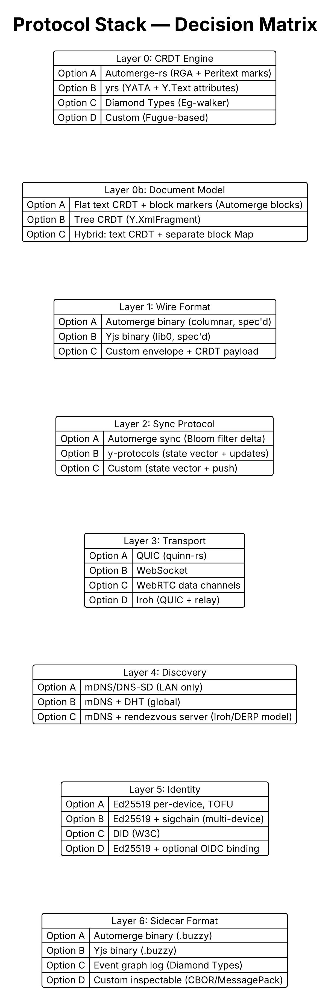
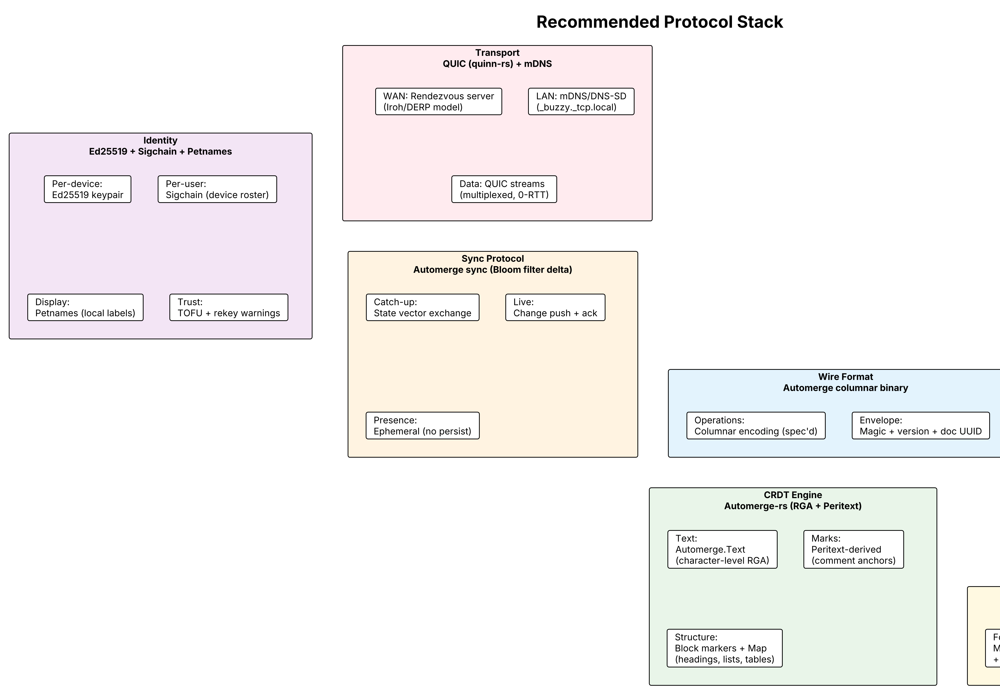

# Buzzy — Protocol & Format Research

## Purpose

This document surveys the available building blocks for buzzy's protocol stack: CRDT algorithms, wire formats, sync protocols, transport layers, identity systems, and on-disk storage formats. Each section presents the alternatives, their trade-offs, and a recommendation. These decisions must be made before implementation begins — everything in the MVP LLD depends on them.

---

## Decision Stack Overview



Seven layers require independent decisions. Each is discussed below with alternatives and a recommendation.

---

## 1. CRDT Algorithm

The merge engine is the core of buzzy. It determines how concurrent edits are resolved, what metadata is carried per character, and what the performance profile looks like.

### Alternatives

| Algorithm | Implementation | Concurrent-insert ordering | Interleaving quality | Memory model | Rich text | Block structure | Production readiness |
|-----------|---------------|---------------------------|---------------------|-------------|-----------|----------------|---------------------|
| **RGA** | Automerge-rs | OpId under parent | Good (not provably maximal) | O(ops), history retained | Yes (Peritext marks) | Yes (block markers + Map) | High (v3.2.6) |
| **YATA** | yrs (Rust port of Yjs) | ClientId + rightOrigin | Good (not provably maximal) | O(items), RLE-compressed | Yes (Y.Text attributes) | Yes (Y.XmlFragment) | High |
| **Fugue** | TypeScript (Collabs) | Tree-structured | Provably maximal non-interleaving | O(items) | No | No | Research / small deployments |
| **Eg-walker** | Diamond Types (Rust) | YATA-family semantics | Same as YATA | O(document) steady-state | No | No (WIP) | WIP, single maintainer |

### Detailed analysis

**Automerge-rs (RGA + Peritext)**

Strengths:
- Rust-native; fits buzzy's daemon architecture directly
- Ships Peritext-derived rich-text marks — first-class comment anchoring via sticky positions
- Block-level document model (block markers + Map/List layer) with ProseMirror and CodeMirror bindings
- Columnar binary format with published spec
- Built-in sync protocol (Bloom filter delta exchange)
- `automerge-repo` provides networking abstractions
- Full history retention — enables time-travel, per-user undo, AI operation-stream features
- Formally verified (partial Isabelle proofs)

Weaknesses:
- History retention means larger sidecars for long-lived documents (mitigated by compaction)
- Load time historically linear in history (v3.x snapshot mitigates)
- Smaller editor-binding ecosystem than Yjs (fewer pre-built integrations)
- Interleaving not provably maximal (rarely user-visible in practice)

**yrs (YATA — Rust port of Yjs)**

Strengths:
- Battle-tested algorithm (Yjs powers Notion-like apps, Outline, AFFiNE, HedgeDoc)
- Largest editor-binding ecosystem: ProseMirror, Tiptap, Quill, CodeMirror, Monaco, Slate
- `Y.UndoManager` — per-user undo with transaction-origin filtering (most practical multi-user undo)
- `Y.XmlFragment` — native tree-structured types for block-level documents
- Awareness protocol — presence/cursors as a separate concern (ephemeral, not persisted in CRDT)
- RLE compression on Items — excellent memory efficiency
- Fastest raw performance in benchmarks

Weaknesses:
- Rust port (yrs) is mature but ecosystem gravity is in JavaScript
- No native rich-text marks with Peritext semantics — annotations are layered via RelativePosition (DIY)
- No built-in comment anchoring that survives concurrent edits at the mark level
- No history retention by default — trades history for performance
- Binary format is less well-documented than Automerge's

**Diamond Types / Eg-walker**

Strengths:
- Radically better memory (O(document) not O(operations)) — crucial for very long-lived documents
- Fast cold-load (proportional to document size, not edit count)
- Novel architecture (event graph) theoretically cleaner

Weaknesses:
- Single maintainer (Joseph Gentle); cargo package acknowledged "out of date"
- No rich text, no block structure, no tree types
- No standardised wire format for interop
- No editor bindings beyond basic WASM
- Production risk: ecosystem is thin

**Fugue**

Strengths:
- Provably maximal non-interleaving (the only algorithm with this property)
- Correctness guarantee matters if users frequently type at the same position

Weaknesses:
- TypeScript reference only; no Rust implementation
- No rich text, no block structure
- No standardised wire format
- Would require building an entire ecosystem from scratch
- Marginal practical improvement over RGA/YATA for typical editing patterns

### Recommendation

**Automerge-rs for MVP.** Rationale:

1. Rust-native path — no FFI bridge to maintain
2. Peritext marks solve comment anchoring (buzzy's hardest UX problem after basic sync)
3. Built-in sync protocol reduces networking work
4. History retention enables post-MVP AI features (operation-stream intelligence)
5. Published binary spec means the sidecar format is documented and stable

**Revisit if:** Performance benchmarks on 100KB+ documents show unacceptable latency (fallback: yrs). The block-level model doesn't map cleanly to markdown structure (fallback: Y.XmlFragment via yrs).

---

## 2. Document Model (Block Structure)

How markdown structure (headings, paragraphs, lists, tables, code blocks) maps onto the CRDT.

### Alternatives

| Approach | How it works | Pros | Cons |
|----------|-------------|------|------|
| **Flat text CRDT** | Entire document is one text sequence; markdown syntax is just characters | Simplest; external edits trivially map | No structural awareness; concurrent edits can corrupt markdown syntax |
| **Block markers in text** (Automerge blocks) | Special marker characters delimit blocks within the text sequence; separate Map stores block metadata | Structural awareness; backward-compatible with text view | Markers visible in raw CRDT traversal; complexity in marker management |
| **Tree CRDT** (Y.XmlFragment) | Document is a tree of typed nodes (paragraph, heading, list-item); each leaf is a text CRDT | Full structural semantics; ProseMirror-compatible | External edit reconciliation is much harder (must parse MD → tree diff) |
| **Hybrid** | Text CRDT for content within blocks; separate List/Map CRDT for block ordering and metadata | Clean separation; block moves don't touch text | Two CRDTs to coordinate; consistency between them is the developer's problem |

### Recommendation

**Flat text CRDT for MVP** (entire document is `Automerge.Text`). Rationale:

- External edit detection reduces to text diff (Myers algorithm) — no tree parsing needed
- The `.md` file IS the text in the CRDT — no serialisation gap
- Markdown structural integrity is validated post-merge (reject if malformed) rather than enforced by the CRDT model
- Block-level model is an optimisation for post-MVP when we understand the actual failure modes from dogfooding

**Post-MVP migration path:** Introduce block markers or tree structure once comment anchoring and block-level operations (move paragraph, indent list) prove necessary. The flat model is forward-compatible — it's a subset of the block model.

---

## 3. Wire Format & Sync Protocol

### Alternatives

| Protocol | Mechanism | Awareness (presence) | Bandwidth | Rust support | Maturity |
|----------|-----------|---------------------|-----------|-------------|----------|
| **Automerge sync** | Bloom filter identifies missing changes; delta exchange until convergence | Separate (DIY) | Efficient (only missing changes sent) | Native (automerge-rs) | High |
| **y-protocols** | State vector (clock per client); missing updates sent as binary blobs | Built-in awareness protocol | Very efficient (smallest updates) | Via yrs | High |
| **Custom** | State vector + push (similar to y-protocols) | Custom | Controllable | Built from scratch | None |

**Automerge sync protocol details:**

Wire message structure (from `rust/automerge/src/sync.rs`):

```rust
pub struct Message {
    pub heads:   Vec<ChangeHash>,   // sender's frontier (32-byte SHA-256 each)
    pub need:    Vec<ChangeHash>,   // hashes sender explicitly requests
    pub have:    Vec<Have>,         // Bloom summary of what sender has
    pub changes: ChunkList,         // change chunks for recipient to apply
}
pub struct Have { last_sync: Vec<ChangeHash>, bloom: BloomFilter }
```

Protocol flow:
1. Each peer maintains a `SyncState` per remote peer (persists `shared_heads` across sessions)
2. `generateSyncMessage()` produces: heads + Bloom filter of change hashes (default: 10 bits/entry, 7 probes, ~1% false positive)
3. Peer receives, walks reachable changes beyond `⋃ have.last_sync`, drops hashes present in Bloom, sends missing changes
4. Repeat until both sides generate `None` (converged)
5. Compaction shortcut: if send-set > ~⅓ of graph, substitute full `doc.save()` document
6. After catch-up: push individual changes as they occur (live mode)

Wire byte layout: version byte (`0x42` V1, `0x43` V2) + uLEB-counted arrays for heads/need/have/changes. V2 adds flags: `SYNC_RESET`, `READ_ONLY`, `SUPPORTS_SYNC_RESET`.

**y-protocols details:**

Message type IDs: `SyncStep1 = 0`, `SyncStep2 = 1`, `Update = 2`.

Wire format (lib0 encoding):
- SyncStep1: `varUint(0) · varBuffer(stateVector)` — state vector = `varUint(numClients) · (varUint(clientID) · varUint(clock))*`
- SyncStep2: `varUint(1) · varBuffer(documentUpdate)` — binary Yjs update (missing changes)
- Update: `varUint(2) · varBuffer(documentUpdate)` — live incremental update

Composite framing: outer `varUint(topLevelType)` — `0 = SyncProtocol`, `1 = AwarenessProtocol`.

Awareness protocol (ephemeral, separate):
```
awarenessUpdate := varUint(numEntries) ·
                   (varUint(clientID) · varUint(clock) · varString(JSON.stringify(state)))*
```
Outdated timeout: 30s. Check interval: 3s. `state = null` marks offline.

**Bandwidth comparison (Kevin Jahns's B4 benchmark, 260k ops):**
- Automerge 2.x: **129 KB** (~1.23× final text size)
- Yjs: **160 KB** (~1.53× final text size)
- Automerge 0.14.1 (pre-columnar): 84 MB — the columnar rewrite achieved ~650× improvement

**Key caveat:** No vendor-neutral CRDT wire format exists. Automerge and Yjs are the only mature options. Protocol Buffers, FlatBuffers, MessagePack, and CBOR are NOT used by any major CRDT system as an op wire format — custom columnar RLE dominates on bandwidth grounds.

### Recommendation

**Automerge sync protocol** (follows from choosing Automerge-rs as the CRDT engine). The sync protocol is tightly integrated with the CRDT format — using Automerge's CRDT with a different sync protocol would mean reimplementing the state tracking.

**Presence as a separate layer** (following Yjs's architectural wisdom): presence is ephemeral, unreliable, and should not touch the CRDT or sidecar. Implement as a simple JSON broadcast over the same QUIC connection but on a separate stream, with 5-second timeout for stale cursors.

### Existing sync frameworks (for comparison, not adoption)

buzzy builds its own sync layer rather than adopting a framework, because existing options assume different architectures:

| Framework | Architecture | Why not for buzzy |
|-----------|-------------|------------------|
| **automerge-repo** | Doc-graph with pluggable adapters; star topology via sync-server | Splits docs into `snapshot + incremental` chunks keyed by `[docId, chunkType, chunkId]` — wrong shape for buzzy's one-file-one-sidecar model |
| **y-sweet** | Rust server + TS SDK; per-doc processes with S3 cold storage | Server-centric; not peer-to-peer; buzzy's daemon IS the server |
| **PartyKit** | Cloudflare Durable Objects; per-doc rooms | Cloud-dependent; no local-first or P2P story |
| **Liveblocks** | Proprietary server; Yjs bridge | Closed source; managed service; opposite of buzzy's philosophy |
| **Iroh (docs)** | Multi-writer KV with LWW timestamps; iroh-gossip for broadcast | LWW conflict resolution (not CRDT merge); documents are KV entries, not text |

**What buzzy borrows:**
- From automerge-repo: the `Presence` primitive concept (ephemeral, heartbeat-based)
- From Yjs awareness: the separation of presence from CRDT state
- From Iroh: the relay/hole-punch transport architecture; the discovery/transport split
- From Automerge sync protocol directly: the Bloom-filter-delta-exchange mechanism (used as-is)

---

## 4. Transport Layer

### Alternatives

| Transport | Latency | NAT traversal | Multiplexing | Encryption | Rust crate | Complexity |
|-----------|---------|---------------|-------------|-----------|-----------|-----------|
| **QUIC** (quinn-rs) | Low (0-RTT reconnect) | Built-in hole punching | Native (streams) | TLS 1.3 mandatory | quinn ^0.11 | Medium |
| **WebSocket** | Low | Requires TURN relay | Manual (framing) | TLS optional | tokio-tungstenite | Low |
| **WebRTC data channels** | Low | ICE + STUN/TURN | Native (SCTP) | DTLS mandatory | webrtc-rs | High |
| **Iroh** (n0) | Low | DERP relay + hole punch | QUIC-based | Built-in | iroh ^0.35 | Medium |
| **libp2p** | Variable | DHT + relay | Multiple transports | Noise/TLS | rust-libp2p | High |

**Iroh deserves special attention.** Built by n0 (former Protocol Labs team), Iroh is a Rust library that wraps QUIC with:
- NodeID = Ed25519 pubkey (identity IS the routing address)
- Relay servers for NAT traversal (DERP-inspired, from Tailscale)
- Hole punching with relay fallback
- Content-addressed blob sync (BLAKE3 hashes)
- Magic socket that transparently upgrades relay → direct connection

This maps extremely well onto buzzy's architecture: the daemon's Ed25519 identity keypair IS the Iroh NodeID; peer discovery and relay are built-in; no separate mDNS or QUIC stack needed.

### Recommendation

**Two-phase approach:**

1. **MVP: Raw QUIC (quinn-rs) + mDNS.** Simplest; LAN-only scope means no NAT traversal needed; maximum control over the protocol.

2. **Post-MVP: Evaluate Iroh as the networking layer.** If Iroh's maturity proves sufficient, it replaces both quinn and mDNS with a unified solution that includes relay, hole-punching, and NodeID-based addressing. The trade-off is dependency on a single library vs. building the same capabilities from scratch.

---

## 5. Peer Discovery & Identity

### Alternatives — Discovery

| Mechanism | Scope | Latency | Infrastructure | Failure mode |
|-----------|-------|---------|---------------|-------------|
| **mDNS/DNS-SD** | LAN only | Instant (<1s) | None (multicast) | Blocked on enterprise WiFi; no cross-subnet |
| **DHT (Kademlia)** | Global | 2-10s cold lookup | Bootstrap nodes | IP addresses effectively public; churn-sensitive |
| **Rendezvous server** | Global | <500ms | Small stateless server | Server downtime = no new connections (existing stay up) |
| **Iroh relay** | Global | <500ms | Relay server | Same as rendezvous + doubles as fallback data path |

### Alternatives — Identity

| System | Multi-device | Key rotation | User experience | Maturity |
|--------|-------------|-------------|-----------------|----------|
| **Ed25519 per-device (raw)** | No (each device is a separate identity) | Replace key = new identity | Simple but limiting | Universal |
| **Ed25519 + sigchain** | Yes (device roster signed by master key) | Append revocation to chain | Keybase/Matrix model | Proven |
| **DID (W3C)** | Via DID document updates | Via signed operation log | JSON-LD overhead; overkill | Niche |
| **Ed25519 + OIDC binding** | Via provider account | Provider-mediated | Familiar but adds trust dependency | Infrastructure-mature |

### Recommendation

**Identity: Ed25519 per-device + sigchain for multi-device + petnames for display.**

- Each device generates an Ed25519 keypair on first run
- A "user" is a sigchain: master key + signed device roster
- Same user's laptop and desktop both carry the master key's signature → treated as one collaborator
- Display names are petnames (locally-scoped, user-assigned per contact — Syncthing model)
- Trust: TOFU with rekey warnings (SSH/Signal model); optional QR/emoji verification for paranoid users
- Recovery: new device signed in by an existing device; optional OIDC binding as last-resort recovery

**Discovery: mDNS for LAN + rendezvous server for WAN.**

- LAN: `_buzzy._tcp.local` via mDNS/DNS-SD; TXT record contains device pubkey fingerprint
- WAN: lightweight rendezvous server (same role as Iroh's relay / Tailscale's DERP)
- Rendezvous server is dumb: routes encrypted connection requests by pubkey; cannot read content
- DHT explicitly rejected for MVP: cold-lookup latency (2-10s), IP exposure, maintenance burden

---

## 6. Sidecar Format (On-Disk Storage)

### The design constraint

buzzy's defining invariant: **the `.md` file is always a valid, complete, human-readable document without the sidecar.** If you delete the sidecar, you lose collaboration history and CRDT metadata — but you keep your document. This constraint is novel; no tool in the survey (AFFiNE, Outline, Obsidian-livesync) enforces it.

### Alternatives

| Format | Content | Size | Inspectable | Recovery |
|--------|---------|------|-------------|----------|
| **Automerge binary** (.buzzy) | Full CRDT state (compacted) | ~5-50x document size (depends on edit history) | No (binary) | Load with automerge CLI; or delete and re-bootstrap from .md |
| **Yjs binary** (.buzzy) | CRDT state without history | ~2-10x document size | No (binary) | Load with yjs tooling; same recovery |
| **Event graph log** (Diamond Types) | Append-only edit log | Grows unbounded without compaction | Partially (structured binary) | Replay log to reconstruct |
| **Custom inspectable** (CBOR/MessagePack) | CRDT state in a documented, toolable format | Larger (schema overhead) | Yes (with standard tools) | Standard parsers available |
| **SQLite** | CRDT state in tables | Larger but queryable | Yes (sqlite3 CLI) | Standard tooling |

### What other tools do

| Tool | On-disk format | CRDT canonical? | Plaintext readable without runtime? |
|------|---------------|-----------------|-------------------------------------|
| **Obsidian** | Plain .md + .obsidian/ config | N/A (no CRDT) | Yes |
| **AFFiNE** | Opaque blob (Yjs binary via IndexedDB/SQLite) | Yes — CRDT is truth | No |
| **Outline** | Postgres (Yjs state column) + markdown fallback column | Yes — CRDT is truth | No (server-dependent) |
| **Logseq** | Plain .md / .org files | N/A (no CRDT) | Yes |
| **Obsidian-livesync** | PouchDB (CouchDB protocol) alongside .md files | CouchDB is truth | Partially (files exist but may lag) |
| **buzzy** (proposed) | Plain .md + .buzzy binary sidecar | **No — .md is truth** | **Yes (by design)** |

buzzy inverts the normal model: the plaintext file is canonical, and the CRDT sidecar enables collaboration but is not authoritative. If sidecar and .md diverge (e.g., user edited with bzz stopped), the .md wins and the daemon re-diffs to reconcile.

### Sidecar storage location (critical Obsidian finding)

**Obsidian treats dot-prefixed files and folders as non-existent.** They don't appear in the file explorer, aren't indexed, and links to them resolve as broken. This eliminates the "hidden dotfile sidecar" option.

| Option | Layout | Obsidian behaviour | Git / rsync | Cloud sync (Dropbox/iCloud) | Clutter |
|--------|--------|-------------------|-------------|----------------------------|---------|
| **A: Visible siblings** | `notes.md.buzzy` next to `notes.md` | Visible in explorer (junk file) | Normal tracking | Normal | High (N files × 3 sidecars) |
| **B: Plugin state directory** | `.obsidian/plugins/buzzy/state/<hash>.bin` | Hidden (Obsidian convention) | Needs explicit add | May be excluded | None |
| **C: Vault-root dotdir** | `.buzzy/state/<hash>.bin` | Hidden (dot-directory) | Needs explicit add | iCloud may strip (unverified) | None |
| **D: Hidden dotfile** | `.notes.md.buzzy` | **BROKEN — Obsidian ignores** | Needs explicit add | May be excluded | None |

**Additional context from Obsidian ecosystem research:**
- Both existing Obsidian collab plugins (Relay, Peerdraft) use Yjs and hold state server-side or in memory — neither persists CRDT state to a visible file
- obsidian-livesync uses PouchDB (CouchDB protocol), not CRDTs
- Do NOT embed CRDT bytes in YAML frontmatter — Obsidian's Properties UI would render it as a corrupt property
- Users commonly run multiple sync tools concurrently; scattered sidecar files risk partial replication races

### Recommendation

**Option C for MVP: `.buzzy/` directory at vault root.**

```
vault/
├── .buzzy/
│   ├── config.toml              (vault-level buzzy config)
│   ├── state/
│   │   ├── <doc-uuid>.bin       (Automerge binary per document)
│   │   └── <doc-uuid>.bin       
│   └── index.json               (path → UUID mapping)
├── meeting-notes.md             (plain markdown, no clutter)
├── project-spec.md
└── .obsidian/                   (Obsidian's own config)
```

Rationale:
- Editor-agnostic (not tied to `.obsidian/plugins/` convention)
- Invisible in Obsidian (dot-directory)
- Single directory to `.gitignore`, protect from rsync races, exclude from cloud sync
- Works for VS Code, Neovim, or any future editor plugin (same path convention)
- If a user copies a single `.md` to another vault, it becomes a fresh document (correct semantic)
- Recovery: delete `.buzzy/` → daemon re-bootstraps all documents from `.md` content on next start

**Index file (`index.json`):**
```json
{
  "documents": {
    "550e8400-e29b-41d4-a716-446655440000": {
      "path": "meeting-notes.md",
      "lastModified": "2026-07-20T14:30:00Z",
      "lastRenderedHash": "sha256:abc123..."
    }
  }
}
```

The index maps UUIDs to file paths and tracks the last-rendered hash (for external edit detection). If the index is missing or corrupt, the daemon rebuilds it by scanning the vault.

**Sidecar binary format (raw Automerge, no custom envelope needed):**

Research confirms Automerge's binary format already provides:
- Magic bytes: `[0x85, 0x6f, 0x4a, 0x83]` per chunk
- 4-byte SHA256-prefix checksum
- Forward compatibility: unknown columns/value-tags/action-codes MUST be retained through read-write cycles
- Columnar RLE + DEFLATE compression

The UUID-to-path mapping lives in `index.json` rather than embedded in the binary. This avoids wrapping Automerge's format with a custom envelope — the `.bin` files are raw `doc.save()` output, readable by any Automerge tool.

### Block identity for comment anchoring (Logseq prior art)

Logseq uses inline `id:: <uuid-v4>` annotations for stable block identity that survives line-based edits. For buzzy, an HTML comment variant preserves this across editors:

```markdown
<!-- buzzy:block abc123 -->
## Meeting Notes

This paragraph has a comment anchored to it.
```

HTML comments render as empty in Obsidian/Logseq preview, are preserved by most markdown processors, and give Peritext's opId-based anchoring a fallback when the CRDT sidecar is absent (e.g., file shared without buzzy).

---

## 7. External Edit Reconciliation

This is the "file modified externally" problem — unique to buzzy because no other collaborative tool treats plaintext as canonical.

### How others handle analogous problems

| Tool | "External edit" equivalent | Solution |
|------|---------------------------|----------|
| **Outline** | REST API writes to DB while collab session active | State vector diff: `Y.encodeStateAsUpdate(dbDoc, liveStateVector)` → apply to live doc |
| **Obsidian-livesync** | File changed on disk while CouchDB has different version | CouchDB conflict resolution; file on disk may be overwritten |
| **AFFiNE** | N/A (no external edits possible — opaque format) | — |
| **Git** | Working tree modified while index has different state | `git diff` + merge/rebase |

### buzzy's approach — Automerge's `text_diff.rs` solves this natively

**Critical finding:** Automerge ships a Myers-diff-to-CRDT-ops implementation in Rust (`rust/automerge/src/text_diff.rs`). The public API is `Transaction::update_text` — given the current CRDT state and the new file content, it internally runs Myers diff, aligns to grapheme boundaries via `unicode_segmentation`, and emits splice ops advancing the doc's `TextEncoding` cursor.

This means buzzy does NOT need to implement the diff → CRDT-ops translation step from scratch. The daemon calls one function:

```rust
// External edit detected — reconcile file with CRDT
fn handle_external_edit(&mut self, path: &Path) -> Result<()> {
    let file_content = fs::read_to_string(path)?;
    let crdt_content = self.doc.text(&self.text_obj);
    
    if file_content == crdt_content {
        return Ok(()); // Write was our own render
    }
    
    // Automerge's built-in text diff → CRDT ops
    let mut tx = self.doc.transaction();
    tx.update_text(&self.text_obj, &file_content)?;
    tx.commit();
    
    // Broadcast incremental change to peers
    let change = self.doc.save_incremental();
    self.broadcast_change(change);
    
    Ok(())
}
```

**Yjs has no equivalent.** Consumers must diff externally and translate to `Y.Text` ops themselves. This is a decisive advantage for Automerge as buzzy's CRDT engine.

### Reconciliation flow

```
1. FS watcher detects .md write (not caused by daemon)
2. Debounce (100-500ms, batch rapid saves)
3. Read file content ("actual")
4. Render CRDT state to text ("expected")
5. If actual == expected: no-op (our own write)
6. Else: call Transaction::update_text(text_obj, actual)
   → Automerge internally runs Myers diff
   → Emits splice ops with daemon's actor ID
   → Aligns to grapheme boundaries
7. Validate block tree post-apply (if malformed, revert .md from CRDT)
8. Broadcast incremental change to peers
9. Write updated sidecar
```

### Open risks

| Risk | Impact | Mitigation |
|------|--------|-----------|
| External edit corrupts markdown structure | CRDT accepts syntactically invalid state | Validate parsed block tree post-apply; warn user if malformed |
| Rapid external writes (auto-save editors) | Excessive diffing and CRDT churn | Debounce + coalesce; only diff when file is stable for 100-500ms |
| Large file replacement (vim write pattern: tmp + rename) | Watcher sees delete + create; false "new document" | Track by UUID in index.json; debounce covers atomic rename |
| Diff produces semantically wrong ops on ambiguous changes | User intent lost (moved paragraph looks like delete + insert) | Accept: move detection is NP-hard for text; insert/delete is correct if not optimal |
| Destructive external edit (user deletes half the doc) | Large delete op indistinguishable from intentional | Warn on suspiciously-large deltas; auto-save snapshot to CRDT history before applying |

---

## Recommended Protocol Stack (Summary)



| Layer | Choice | Key reason |
|-------|--------|-----------|
| CRDT engine | Automerge-rs | Rust-native; Peritext marks; built-in sync |
| Document model | Flat text (MVP) → blocks (post-MVP) | External edit simplicity; forward-compatible |
| Wire format | Automerge columnar binary | Published spec; native to chosen engine |
| Sync protocol | Automerge sync (Bloom filter delta) | Integrated with engine; handles offline/reconnect |
| Presence | Custom ephemeral JSON (separate stream) | Not persisted; Yjs awareness pattern |
| Transport | QUIC via quinn-rs (MVP) → Iroh (post-MVP) | Low latency; multiplexed; 0-RTT reconnect |
| Discovery (LAN) | mDNS/DNS-SD | Zero-config; proven (Syncthing, AirDrop) |
| Discovery (WAN) | Rendezvous server (post-MVP) | Stateless; doubles as relay; no IP exposure |
| Identity | Ed25519 per-device + sigchain | Decentralized; multi-device; no account server |
| Trust model | TOFU + rekey warnings | SSH/Signal model; developer-friendly |
| Display names | Petnames (local-scoped labels) | Zooko's triangle resolved; Syncthing model |
| Sidecar format | Raw Automerge binary (no custom envelope) | Forward-compatible; published spec; standard tooling |
| Sidecar location | `.buzzy/state/<uuid>.bin` (vault-root dotdir) | Invisible in Obsidian; editor-agnostic; single gitignore |

---

## Key Findings from Research

### Finding 1: No standard exists for plain-text-plus-CRDT-metadata

No IETF draft, W3C spec, or industry convention addresses attaching CRDT collaboration state to plain text files. CriticMarkup covers tracked changes but is a single-tool convention, not CRDT state. The W3C Web Annotation Data Model covers anchoring but not operations. XMP (ISO 16684-1) is for image metadata.

**Implication:** buzzy is defining a novel convention. This is a positioning opportunity (potential standard-setter) and a risk (no ecosystem gravity to leverage).

### Finding 2: buzzy inverts the normal local-first architecture

Every existing collaborative local-first tool (AFFiNE, Outline, Pushpin) treats the CRDT as canonical and exports to plaintext as a lossy serialization step. buzzy inverts this: plaintext is canonical, CRDT enables collaboration. No prior art validates this model at scale.

**Implication:** The "file modified externally" reconciliation path is genuinely novel engineering. Outline's state-vector-diff mechanism is the closest analogy but operates on structured data, not plain text. The text-diff → CRDT-ops translation step is on us.

### Finding 3: Automerge and Yjs are the only production-ready options

Fugue, Diamond Types, and Eg-walker are research-grade or single-maintainer projects. For a product shipping in 12 weeks, the real decision is Automerge vs Yjs. Automerge wins for buzzy because:
- Rust-native (daemon language)
- Peritext marks (comment anchoring without DIY)
- History retention (AI features need operation stream)
- Published binary spec (sidecar is documented)

Yjs wins on ecosystem breadth (more editor bindings) and raw performance (RLE Items). If buzzy were building an editor application rather than a daemon+protocol, Yjs would be the stronger choice.

### Finding 4: Iroh is the natural post-MVP networking layer

Iroh's design (Ed25519 NodeID = identity, QUIC transport, relay servers for NAT traversal) maps almost perfectly onto buzzy's architecture. The only reason not to use it for MVP is maturity risk — it's evolving rapidly. Starting with raw QUIC + mDNS for the LAN-only MVP, then evaluating Iroh for the WAN phase, is the pragmatic path.

### Finding 5: Presence must be architecturally separate from the CRDT

Yjs's architectural decision to make awareness (cursors, selections, user status) a separate ephemeral protocol — not persisted in the CRDT — is correct. Presence is high-frequency, lossy, and disposable. Mixing it into the CRDT would bloat the sidecar with stale cursor positions. buzzy should follow this pattern: presence over a separate QUIC stream, unreliable delivery, 5-second timeout.

### Finding 6: Peritext explicitly rejects "markdown in a plain-text CRDT"

The Peritext essay demonstrates that concurrent formatting operations on plain text produce broken output (e.g., `**The **fox** jumped.**`). Their conclusion: keep text and formatting *separate* — a plain-text CRDT sequence plus mark operations referencing character opIds.

**Implication:** buzzy's MVP "flat text CRDT" approach works for plain markdown without inline formatting marks. But the moment we add comment anchoring or rich-text collaboration, we MUST adopt Peritext's separate-marks model. This validates the "flat text for MVP, block model for post-MVP" phasing — the migration point is when comments ship.

### Finding 7: Automerge's binary format guarantees forward compatibility

The Automerge binary spec (primary source: `automerge.org/automerge-binary-format-spec/`) mandates that unknown columns, value type tags, and action codes MUST be retained through read-write cycles. A `.buzzy/state/*.bin` written by daemon vN survives read-write by daemon vN+1 without lossy conversion.

**Implication:** No custom envelope or version tag needed in the sidecar. buzzy can evolve its block schema (adding comment operations, block markers, etc.) without a format migration — older daemons will preserve fields they don't understand.

### Finding 8: buzzy answers Upwelling's open question

Ink & Switch's 2023 "Upwelling" essay (version control for writers) concludes with an explicit future-work statement: wanting *"a file format or exchange protocol that makes it possible for writers to use the writing software of their choice."* buzzy is a concrete proposal for this protocol.

**Implication:** Defensible positioning. buzzy is not "another local-first tool" — it's the interop layer that Ink & Switch's own research called for but didn't build.

### Finding 9: Identity best practice is Ed25519 + sigchain + DERP relay

Cross-tool analysis (Syncthing, Signal, Matrix, Iroh, Tailscale, IPFS) converges on:
- **Identity = raw Ed25519 pubkey** (not certificate-wrapped). Iroh and IPFS have it right; Syncthing's cert coupling is a rotation burden.
- **Multi-device = master key + signed device roster** (Matrix cross-signing model). Verify once per human, not once per device pair.
- **NAT traversal = DERP-style always-on relay + hole punch** (Tailscale/Iroh). DHT is rejected: 2-10s cold lookup, IP exposure, maintenance burden.
- **Trust = TOFU + rekey warnings** (SSH/Signal model). PGP Web of Trust failed; introducers (Syncthing) are footguns.
- **Onboarding bar = one command + one QR code** (Tailscale `tailscale up` level of simplicity).

---

---

## NAT Traversal Strategy

Research (Ford et al. 2005, Tailscale/Iroh telemetry) converges on **~80-90% UDP hole-punch success rate** on consumer networks, dropping to **~10-20% sustained relay** for mobile CGNAT, symmetric NATs, and enterprise firewalls.

### Attempt order (Tailscale/Iroh precedent)

| Step | Method | Expected success | Latency |
|------|--------|-----------------|---------|
| 1 | Cached direct path (last-known IP:port) | High if peer hasn't moved | <50ms |
| 2 | LAN mDNS discovery → direct QUIC | ~100% on same LAN | <100ms |
| 3 | STUN-observed candidates + coordinated hole-punch via relay | 70-85% of NAT pairs | 200-500ms |
| 4 | Birthday-paradox port prediction (both behind NAT) | Variable (can take minutes for symmetric) | 1-30s |
| 5 | DERP-style relay fallback | 100% (relay forwards ciphertext) | +50-100ms RTT penalty |
| 6 | MASQUE/HTTPS-443 escape (hostile networks with DPI) | Post-MVP | Higher |

### Design decisions

- **Skip TURN entirely.** DERP-style relays (HTTPS-transported, pubkey-addressed, no per-client auth setup) cover the same territory more cheaply. Tailscale explicitly rejected TURN: "no real interoperability benefit."
- **UPnP/PCP/NAT-PMP as opportunistic optimization only.** CVE history (CallStranger CVSS 7.5, miniupnpd RCEs) and enterprise disablement mean these are never load-bearing.
- **Start on relay, upgrade transparently.** Connection begins via relay immediately (low latency to first byte); background probes attempt direct path; upgrade happens invisibly. This is how Tailscale works.
- **Budget for ~10-20% sustained relay traffic.** Plan infrastructure accordingly; DERP relay cost is cheap (forwarding already-encrypted bytes, no TURN-style media processing).

### MVP implication

MVP is LAN-only (mDNS + direct QUIC). NAT traversal is entirely post-MVP — but the relay architecture should be *designed* now (separate QUIC stream for relay signaling) so it plugs in cleanly.

---

## Key Management UX

### Device onboarding (QR pairing)

```
1. Existing device: bzz pair → shows QR code
   (contains: ephemeral X25519 pubkey + relay address + device fingerprint)
2. New device: bzz join → scans QR
3. Authenticated key exchange over relay
4. Existing device signs new device's pubkey into the device roster
5. Roster change replicates to all peers on next sync
6. New device pulls document state from existing device
```

One gesture. Follows Signal/Tailscale precedent.

### Recovery (for total device loss)

Two independent paths — users pick one or both:

| Path | Mechanism | UX | Threat model |
|------|-----------|---|-------------|
| **PIN + attested enclave** | Argon2(PIN) → Shamir 2-of-3 across attested enclaves; 10-attempt hard limit | "Enter your PIN to recover" | Trusts enclave attestation |
| **BIP39 recovery phrase** | 24 words at setup; encodes master key | "Enter your 24 words" | Trusts only the user; permanent loss if forgotten |
| **OIDC binding (optional)** | Sign challenge with OIDC-linked pubkey to authorize new device | "Sign in with Google/SSO" | Adds OIDC provider as trust dependency |

### Key transparency

Publish device roster to a verifiable append-only log (Keybase/WhatsApp KT precedent). Clients audit silently; warn only on mismatch. No user-visible surface unless something is wrong.

### Invisible protocol upgrades

Design the identity layer so cipher-suite migrations (e.g., adding post-quantum Kyber-1024 hybrid) don't disturb the master key or safety fingerprint. Signal's PQXDH transition (September 2023) proved this is possible — no user re-verification needed.

---

## Open Questions (Remaining)

1. **Automerge compaction frequency** — how often to call `doc.save()` vs `doc.save_incremental()` for sidecar writes; trade-off between crash safety and write amplification
2. **Automerge performance at 100KB+** — specific benchmarks needed for the "large meeting notes" case; determines whether eg-walker is needed long-term
3. **Obsidian plugin API constraints** — whether Obsidian's plugin sandbox allows Unix socket connections or requires a WebSocket bridge
4. **iCloud behaviour with `.buzzy/` directory** — whether Apple's cloud storage strips or conflicts on vault-root dot-directories (Dropbox confirmed safe)
5. **W3C Annotation alignment** — whether buzzy's comment-anchor schema should mirror `TextQuoteSelector`/`TextPositionSelector` for interop with annotation tools
6. **CriticMarkup emission** — whether buzzy should optionally emit inline `{>>comment<<}` markers in the `.md` for tools that don't run the daemon

---

## References

### Primary sources consulted

- Automerge documentation and binary format spec (automerge.org/automerge-binary-format-spec/)
- Yjs documentation and y-protocols (docs.yjs.dev, github.com/yjs/y-protocols)
- Fugue paper — Weidner & Kleppmann, IEEE TPDS vol. 36 no. 11, Nov 2025 (arXiv:2305.00583)
- Eg-walker paper — Kleppmann, Gentle, Feltman, EuroSys 2025 (arXiv:2409.14252)
- Diamond Types (github.com/josephg/diamond-types)
- Peritext essay — Ink & Switch (inkandswitch.com/peritext) — including explicit rejection of "markdown in plain-text CRDT"
- "Local-first software" — Kleppmann et al., 2019 (inkandswitch.com/local-first)
- Upwelling — Ink & Switch, 2023 (version control for writers; future-work statement on interop protocol)
- AFFiNE BlockSuite (blocksuite.io/guide/data-synchronization.html) — provider model, snapshot/streaming split
- AFFiNE OctoBase (github.com/toeverything/OctoBase) — Rust Yjs port y-octo
- Outline source code (github.com/outline/outline — PersistenceExtension.ts, APIUpdateExtension.ts, documentCollaborativeUpdater.ts)
- Iroh (iroh.computer) — NodeID, relay/DERP, discovery/transport split
- Syncthing protocol — device IDs, discovery servers, relay architecture
- Signal protocol — Ed25519 identity keys, X3DH, PQXDH, safety numbers
- Matrix cross-signing spec (MSC1756) — master/self-signing/user-signing key hierarchy
- Tailscale — DERP relay design, disco hole-punching, MagicDNS
- IPFS/libp2p — PeerId, Kademlia DHT, AutoNAT, DCUtR, Circuit Relay v2
- Obsidian developer documentation — dotfile handling, plugin storage conventions
- Logseq block-ID convention (`id:: <uuid>`)

### Secondary sources (not directly fetched; claims marked where relevant)

- Cambria — Ink & Switch (schema evolution for CRDTs)
- Keybase sigchain documentation
- Headscale (self-hosted Tailscale control server)
- Zooko's triangle / Szabo's petnames paper (2005)
- W3C Web Annotation Data Model
- CriticMarkup specification
- XMP (ISO 16684-1) sidecar metadata standard
